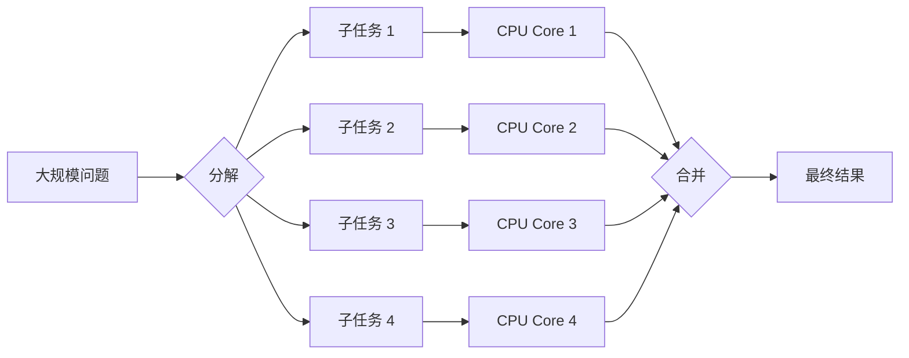

# 第一章 并行计算概述

## 目录

- [1.1 并行计算基础](#11-并行计算基础)
  - [1.1.1 定义与核心思想](#111-定义与核心思想)
  - [1.1.2 费林分类法 (Flynn's Taxonomy)](#112-费林分类法-flynns-taxonomy)
- [1.2 并行计算的动力与优势](#12-并行计算的动力与优势)
  - [1.2.1 加速计算与阿姆达尔定律 (Amdahl's Law)](#121-加速计算与阿姆达尔定律-amdahls-law)
  - [1.2.2 扩展问题规模与古斯塔夫森定律 (Gustafson's Law)](#122-扩展问题规模与古斯塔夫森定律-gustafsons-law)
- [1.3 面临的挑战](#13-面临的挑战)
  - [1.3.1 物理墙：功耗与存储](#131-物理墙功耗与存储)
  - [1.3.2 算法挑战：负载均衡与通信](#132-算法挑战负载均衡与通信)
  - [1.3.3 软件复杂性：数据依赖与调试](#133-软件复杂性数据依赖与调试)
- [1.4 并行计算模型与分类](#14-并行计算模型与分类)
  - [1.4.1 硬件架构分类](#141-硬件架构分类)
  - [1.4.2 编程模型分类](#142-编程模型分类)
  - [1.4.3 执行模式分类](#143-执行模式分类)
- [1.5 应用领域](#15-应用领域)
- [1.6 性能评估](#16-性能评估)
- [1.7 发展趋势](#17-发展趋势)
- [1.8 本章小结](#18-本章小结)
- [练习题](#练习题)

---

## 1.1 并行计算基础

### 1.1.1 定义与核心思想

**并行计算 (Parallel Computing)** 是指同时使用多个计算资源（处理器、核心、计算机）来解决一个计算问题的方法。其核心是将一个大问题分解为若干个可以同时处理的小部分，最后将结果汇总。

并行计算区别于传统的**串行计算**（Serial Computing），后者按指令顺序逐条执行。

**核心步骤**：
1.  **分解 (Decomposition)**：将大任务拆解为小任务（任务并行）或将大数据集拆解为数据块（数据并行）。
2.  **映射 (Mapping)**：将拆解后的任务分配到具体的处理器上。
3.  **执行 (Execution)**：各处理器并行执行分配的任务。
4.  **通信与同步 (Communication & Synchronization)**：处理器间交换数据并协调进度。
5.  **合并 (Result Composition)**：汇总各处理器的结果。

### 1.1.2 费林分类法 (Flynn's Taxonomy)

Michael J. Flynn 提出的分类法是计算机体系结构中最经典的分类方式，根据**指令流** (Instruction Stream) 和 **数据流** (Data Stream) 的数量进行分类：

| 类别 | 描述 | 典型代表 |
| :--- | :--- | :--- |
| **SISD** (单指令单数据) | 传统的串行计算机 | 早期单核 PC，简单的嵌入式系统 |
| **SIMD** (单指令多数据) | 一条指令同时操作多个数据点 | **GPU**, CPU 的 AVX/SSE 指令集 |
| **MISD** (多指令单数据) | 多个指令操作同一个数据流 | 较少见，用于航天容错冗余系统 |
| **MIMD** (多指令多数据) | 多个处理器独立执行不同指令处理不同数据 | **现代多核 CPU**, **集群**, 分布式系统 |

> **注**：现代超级计算机通常是 MIMD 架构（节点间）与 SIMD 架构（节点内加速器）的混合体。

## 1.2 并行计算的动力与优势

### 1.2.1 加速计算与阿姆达尔定律 (Amdahl's Law)

并行计算最直接的目标是缩短程序运行时间。

**阿姆达尔定律 (Amdahl's Law)** 定义了固定负载下，并行化能带来的理论最大加速比。它强调了**串行瓶颈**的影响。

$$ \text{Speedup} \le \frac{1}{S + \frac{1-S}{N}} $$

*   $S$：程序中必须串行执行的比例 ($0 \le S \le 1$)
*   $N$：处理器数量

> **启示**：如果程序中 10% 的代码必须串行 ($S=0.1$)，即使有无限多的处理器 ($N \to \infty$)，最大加速比也只有 10 倍 ($1/0.1$)。优化串行部分至关重要。

### 1.2.2 扩展问题规模与古斯塔夫森定律 (Gustafson's Law)

**古斯塔夫森定律 (Gustafson's Law)** 提出了不同的视角：随着计算能力的增强，我们往往不会只计算相同规模的问题，而是会尝试解决**更大规模**的问题（例如更高分辨率的模拟）。

$$ \text{Scaled Speedup} = N + (1-N) \times S $$

> **启示**：只要问题规模足够大，并行部分占比就会增加，串行部分的负面影响就会被稀释。这解释了为什么我们可以构建拥有百万核心的超级计算机。

## 1.3 面临的挑战

### 1.3.1 物理墙：功耗与存储

*   **功耗墙 (Power Wall)**：提高单核频率会导致功耗和发热呈指数级上升。并行计算通过增加核心数而非单纯提高频率来提升性能，是突破功耗墙的主要手段。
*   **存储墙 (Memory Wall)**：处理器的计算速度增长远快于内存的存取速度增长。数据搬运（Data Movement）成为性能的最大瓶颈。

### 1.3.2 算法挑战：负载均衡与通信

*   **负载均衡 (Load Balancing)**：确保所有处理器都在工作，而不是"一核有难，多核围观"。
    *   *静态均衡*：预先分配，开销小但适应性差。
    *   *动态均衡*：运行时分配（如工作窃取 Work Stealing），适应性强但有管理开销。
*   **通信开销 (Communication Overhead)**：处理器间传输数据需要时间。
    *   **计算通信比**：计算时间应远大于通信时间，否则并行由于通信开销反而变慢。

### 1.3.3 软件复杂性：数据依赖与调试

并行编程比串行编程复杂得多，常见陷阱包括：
*   **竞态条件 (Race Condition)**：多个线程同时修改共享数据，结果依赖于执行顺序。
*   **死锁 (Deadlock)**：线程间相互等待资源，导致程序卡死。
*   **伪共享 (False Sharing)**：不同线程修改同一缓存行中的不同变量，导致缓存频繁失效。

## 1.4 并行计算模型与分类

### 1.4.1 硬件架构分类

1.  **共享内存 (Shared Memory)**：
    *   所有处理器通过总线访问统一的内存空间 (UMA) 或 非统一内存访问 (NUMA)。
    *   *优点*：编程简单，数据共享方便。
    *   *缺点*：扩展性受限（通常几十到几百核）。
2.  **分布式内存 (Distributed Memory)**：
    *   每个处理器有私有内存，通过网络传递消息。
    *   *优点*：扩展性极强（可达数万节点）。
    *   *缺点*：编程复杂（需显式发送/接收数据）。
3.  **混合架构 (Hybrid)**：
    *   节点间分布式，节点内共享内存（如 Cluster of SMPs）。这是目前主流的超算架构。

### 1.4.2 编程模型分类

*   **OpenMP**：基于指令（Pragma）的**共享内存**并行标准。简单易用，适合节点内并行。
*   **MPI (Message Passing Interface)**：基于消息传递的**分布式内存**并行标准。灵活强大，是 HPC 的事实标准。
*   **CUDA / HIP / OpenCL**：针对 **GPU** 等加速器的异构并行编程模型。

### 1.4.3 执行模式分类

*   **数据并行 (Data Parallelism)**：对集合中的每个元素执行相同的操作（如向量加法）。易于扩展。
*   **任务并行 (Task Parallelism)**：各处理器执行完全不同的任务（如一个线程做UI，一个线程做网络请求）。

## 1.5 应用领域

并行计算已从科研走向各行各业：

1.  **科学计算 (HPC)**：
    *   天气预报与气候模拟
    *   核武器模拟与核能研究
    *   计算流体力学 (CFD) (飞机、汽车设计)
    *   生命科学 (蛋白质折叠、基因测序)
2.  **人工智能 (AI)**：
    *   深度学习模型训练 (需要极大规模的矩阵运算，天然适合 GPU 并行)
3.  **大数据分析**：
    *   搜索引擎索引、推荐系统 (Hadoop/Spark 框架)
4.  **金融工程**：
    *   高频交易、风险蒙特卡洛模拟

## 1.6 性能评估

如何衡量并行程序的好坏？

*   **加速比 (Speedup)**：$S_p = T_1 / T_p$。理想情况下 $S_p = p$（线性加速比）。
*   **效率 (Efficiency)**：$E_p = S_p / p$。衡量硬件利用率，通常小于 1。
*   **FLOPS**：每秒浮点运算次数 (Floating-point Operations Per Second)，衡量计算吞吐量的标准指标。
*   **可扩展性 (Scalability)**：
    *   *强可扩展性 (Strong Scaling)*：固定问题总规模，增加处理器，时间减少。
    *   *弱可扩展性 (Weak Scaling)*：固定每个处理器的负载，增加处理器，总问题规模增加，时间维持不变。

## 1.7 发展趋势

1.  **Exascale Computing (百亿亿次计算)**：每秒 $10^{18}$ 次运算的超级计算机时代已经到来。
2.  **异构计算 (Heterogeneity)**：CPU + GPU/TPU/FPGA/NPU 成为标配。通用 CPU 仅负责控制，计算全部卸载到专用加速器。
3.  **AI for Science**: 利用 AI 模型（如 Graph Neural Networks）加速传统的科学模拟。
4.  **绿色计算**: 更加关注能效比 (GFlops/Watt)，降低碳排放。

## 1.8 本章小结

并行计算已成为现代计算机科学的基石。从手机中的多核处理器到国家级的超级计算机，并行处理无处不在。

*   **核心**：分解、通信、同步。
*   **关键定律**：Amdahl 定律（悲观，关注串行瓶颈）与 Gustafson 定律（乐观，关注规模扩展）。
*   **主流模式**：MPI + OpenMP + CUDA 的混合编程模式。

## 练习题

1.  **计算题**：若某程序 80% 的代码可并行化，在 4 核和 16 核处理器上的理论最大加速比分别是多少？（根据 Amdahl 定律）
2.  **思考题**：为什么现代超级计算机不单纯依赖提高 CPU 主频来提升性能？
3.  **调研题**：查阅最新的 TOP500 榜单，分析排名前三的超级计算机采用了何种架构（CPU型号、加速器型号、互连网络）。
4.  **设计题**：假设你要统计一本书中每个单词出现的频率，如何设计一个并行算法？涉及到哪些步骤（Map-Reduce）？
