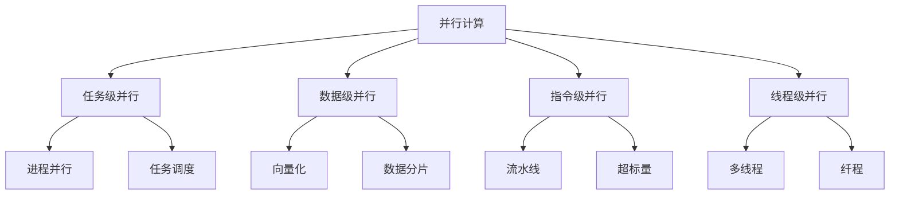

# 第一章 并行计算概述

## 1.1 并行计算的定义

并行计算是指同时使用多个计算资源来解决一个计算问题的方法。在并行计算中，一个大问题被分解成许多小部分，这些小部分可以同时处理，最后将结果合并得到最终答案。

### 核心概念

**并行计算的基本思想**：
1. **分解（Decomposition）**：将大问题分解为可并行处理的小任务
2. **执行（Execution）**：多个处理单元同时执行这些任务
3. **通信（Communication）**：处理单元之间交换必要的信息
4. **同步（Synchronization）**：协调各个处理单元的执行进度
5. **合并（Composition）**：将各个部分的结果合并为最终结果

### 并行计算的层次结构



## 1.2 并行计算的优势

### 1.2.1 加速计算

并行计算最直接的优势是加速计算过程。通过将任务分配给多个处理器，可以显著减少计算时间。

**理论加速比**：
```
Speedup = T_serial / T_parallel
```

其中：
- T_serial：串行执行时间
- T_parallel：并行执行时间

**Amdahl定律**：
```
Speedup ≤ 1 / (S + P/N)
```

其中：
- S：串行部分的比例
- P：并行部分的比例（P = 1 - S）
- N：处理器数量

### 1.2.2 处理大规模问题

并行计算使得处理大规模数据成为可能，这些数据在单个处理器上处理时可能会遇到内存或时间限制。

**应用场景**：
- 基因组测序数据分析
- 气候模拟
- 金融风险评估
- 人工智能训练

### 1.2.3 资源利用

并行计算能够充分利用现代计算系统的多核处理器和分布式系统资源。

**资源利用优势**：
- **多核CPU**：充分利用每个核心的计算能力
- **GPU加速**：利用GPU的大规模并行处理能力
- **分布式系统**：整合多台计算机的计算资源
- **云计算**：动态分配和利用云端计算资源

## 1.3 并行计算的挑战

### 1.3.1 负载均衡

负载均衡是确保所有处理器工作量均匀分布的关键问题。

**负载均衡策略**：
1. **静态负载均衡**：在程序开始前分配任务
2. **动态负载均衡**：运行时根据负载情况调整任务分配

**负载均衡算法**：
```python
# 简单的动态负载均衡示例
def dynamic_load_balancing(tasks, processors):
    """动态负载均衡算法"""
    task_queue = Queue()
    for task in tasks:
        task_queue.put(task)

    # 启动工作进程
    processes = []
    for i in range(processors):
        p = Process(target=worker, args=(task_queue,))
        p.start()
        processes.append(p)

    # 等待所有任务完成
    task_queue.join()

    # 终止所有进程
    for p in processes:
        p.terminate()
```

### 1.3.2 通信开销

处理器间通信可能成为性能瓶颈，特别是在分布式系统中。

**通信模式**：
- **点对点通信**：两个处理器之间的直接通信
- **集体通信**：多个处理器间的协调通信

**通信优化技术**：
1. **通信聚合**：将多个小消息合并为大消息
2. **异步通信**：重叠计算和通信
3. **通信隐藏**：在计算过程中进行通信
4. **拓扑优化**：选择最优的通信路径

### 1.3.3 数据依赖

数据依赖关系限制了任务的并行执行能力。

**数据依赖类型**：
1. **数据流依赖**：一个操作的结果作为另一个操作的输入
2. **反依赖**：一个操作的输出被另一个操作覆盖
3. **输出依赖**：两个操作写入同一内存位置

**依赖关系分析**：
```python
def analyze_dependencies(instructions):
    """分析指令间的依赖关系"""
    dependencies = []

    for i in range(len(instructions)):
        for j in range(i + 1, len(instructions)):
            if has_data_dependency(instructions[i], instructions[j]):
                dependencies.append((i, j, 'data_flow'))
            elif has_anti_dependency(instructions[i], instructions[j]):
                dependencies.append((i, j, 'anti'))
            elif has_output_dependency(instructions[i], instructions[j]):
                dependencies.append((i, j, 'output'))

    return dependencies
```

### 1.3.4 调试复杂性

并行程序的调试比串行程序更加复杂，因为涉及多个执行路径和竞态条件。

**调试挑战**：
1. **竞态条件**：执行结果依赖于线程调度顺序
2. **死锁**：多个线程相互等待资源
3. **活锁**：线程不断重复相同动作而无法前进
4. **数据竞争**：多个线程同时访问共享数据

**调试工具和技术**：
- **静态分析工具**：在编译时检测潜在问题
- **动态分析工具**：在运行时检测问题
- **可视化工具**：显示程序执行流程和状态
- **断言和日志**：添加调试信息

## 1.4 并行计算的分类

### 1.4.1 按粒度分类

**粗粒度并行**：
- 任务较大，通信较少
- 适合分布式系统
- 负载均衡较难

**细粒度并行**：
- 任务较小，通信频繁
- 适合共享内存系统
- 负载均衡较容易

**中粒度并行**：
- 介于粗粒度和细粒度之间
- 平衡计算和通信开销

### 1.4.2 按架构分类

**共享内存系统**：
- 所有处理器共享同一内存空间
- 通信通过共享变量实现
- 同步机制复杂

**分布式内存系统**：
- 每个处理器有独立的内存空间
- 通信通过消息传递实现
- 可扩展性好

**混合内存系统**：
- 结合共享内存和分布式内存的特点
- 适合大规模并行系统

### 1.4.3 按执行模式分类

**数据并行**：
- 相同操作应用于不同数据元素
- 适合SIMD架构
- 通信模式相对简单

**任务并行**：
- 不同任务同时执行
- 适合MIMD架构
- 通信模式复杂

**流水线并行**：
- 将计算分解为多个阶段
- 数据流经各个阶段
- 适合流水线架构

## 1.5 并行计算的应用领域

### 1.5.1 科学计算

**数值模拟**：
- 流体动力学模拟
- 结构力学分析
- 量子化学计算

**优化问题**：
- 组合优化
- 数值优化
- 全局优化

### 1.5.2 工程应用

**计算机辅助设计**：
- 有限元分析
- 计算机图形学
- 仿真模拟

**信号处理**：
- 图像处理
- 音频处理
- 视频编码

### 1.5.3 商业应用

**数据分析**：
- 大数据分析
- 数据挖掘
- 机器学习

**金融计算**：
- 风险评估
- 投资组合优化
- 期权定价

## 1.6 并行计算的性能评估

### 1.6.1 性能指标

**执行时间**：
- 串行执行时间
- 并行执行时间
- 加速比和效率

**资源利用率**：
- CPU利用率
- 内存利用率
- 网络带宽利用率

**可扩展性**：
- 弱可扩展性：问题规模随处理器数量增加
- 强可扩展性：问题规模固定，增加处理器数量

### 1.6.2 性能分析方法

**理论分析**：
- 复杂度分析
- 通信开销估算
- 负载均衡分析

**实验分析**：
- 基准测试
- 性能监控
- 瓶颈识别

**工具支持**：
- 性能分析器
- 可视化工具
- 监控系统

## 1.7 并行计算的发展趋势

### 1.7.1 硬件发展趋势

**多核处理器**：
- 核心数量持续增加
- 异构计算架构
- 专用加速器

**内存技术**：
- 高带宽内存
- 非易失性内存
- 内存计算

**互连技术**：
- 高速互联
- 光互连
- 无线互连

### 1.7.2 软件发展趋势

**编程模型**：
- 更高级的抽象
- 自动并行化
- 领域特定语言

**运行时系统**：
- 智能调度
- 自适应优化
- 容错机制

**工具支持**：
- 可视化编程
- 自动调试
- 性能优化

## 1.8 本章小结

并行计算是一个复杂而强大的计算范式，它通过同时使用多个计算资源来解决计算问题。虽然并行计算带来了显著的性能提升和处理大规模问题的能力，但也面临着负载均衡、通信开销、数据依赖和调试复杂性等挑战。

理解并行计算的基本概念、分类和应用领域，掌握性能评估方法，了解发展趋势，对于有效地设计和实现并行算法至关重要。在后续章节中，我们将深入探讨并行计算的具体技术和应用。

## 练习题

1. **简答题**：解释Amdahl定律的含义及其对并行计算的指导意义。
2. **分析题**：分析一个实际应用中可能存在的数据依赖关系，并提出解决方案。
3. **编程题**：实现一个简单的动态负载均衡算法。
4. **设计题**：设计一个并行算法来解决矩阵乘法问题，并分析其性能。
5. **讨论题**：讨论并行计算在你所在领域的应用前景和挑战。