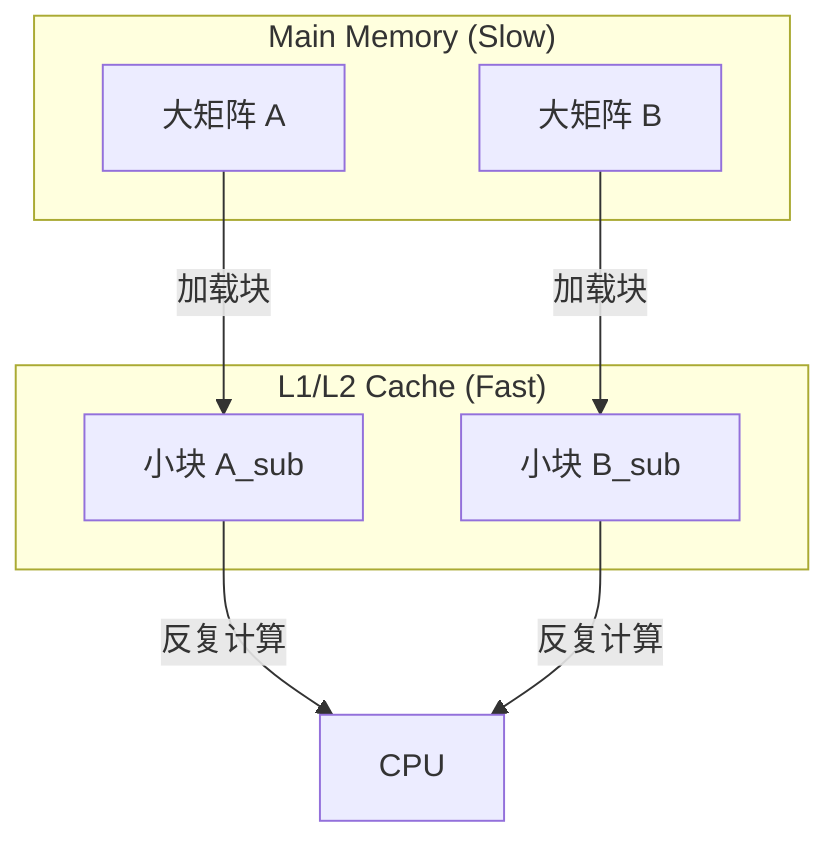

# 第五章 性能优化技术

## 目录

- [5.1 算法级优化](#51-算法级优化)
  - [5.1.1 复杂度分析与并行开销](#511-复杂度分析与并行开销)
  - [5.1.2 数据局部性与分块技术](#512-数据局部性与分块技术)
  - [5.1.3 向量化 (SIMD)](#513-向量化-simd)
- [5.2 内存级优化](#52-内存级优化)
  - [5.2.1 内存对齐与结构体填充](#521-内存对齐与结构体填充)
  - [5.2.2 缓存友好型数据结构 (SoA vs AoS)](#522-缓存友好型数据结构-soa-vs-aos)
  - [5.2.3 内存池与自定义分配器](#523-内存池与自定义分配器)
- [5.3 通信级优化](#53-通信级优化)
  - [5.3.1 通信聚合与延迟隐藏](#531-通信聚合与延迟隐藏)
  - [5.3.2 非阻塞通信与计算重叠](#532-非阻塞通信与计算重叠)
  - [5.3.3 拓扑感知与集合通信优化](#533-拓扑感知与集合通信优化)
- [5.4 性能分析工具简介](#54-性能分析工具简介)
- [5.5 本章小结](#55-本章小结)

---

性能优化是高性能计算的核心环节。它不仅涉及选择正确的算法（O(N) vs O(N^2)），更涉及如何适配底层硬件特性（缓存行、SIMD 单元、网络拓扑）。

## 5.1 算法级优化

### 5.1.1 复杂度分析与并行开销

在并行环境中，评估算法优劣不仅要看**计算复杂度**（Work Complexity），还要看**关键路径长度**（Span/Depth）和**并行开销**。

*   **计算复杂度 $T_1$**：单处理器执行的总工作量。
*   **关键路径 $T_\infty$**：拥有无限处理器时的最短执行时间。
*   **并行度**：$P_{avg} = T_1 / T_\infty$。

**示例：归并排序的并行化**

普通归并排序是 $O(N \log N)$。但在并行化时，如果分割过细，线程创建和同步的开销（Overhead）可能超过计算收益。

```python
from concurrent.futures import ThreadPoolExecutor

def parallel_quick_sort(arr, num_threads=4):
    """
    并行快速排序：结合了粗粒度并行和细粒度串行
    """
    if len(arr) <= 1:
        return arr
    
    # 阈值优化：小数组直接回退到串行排序，避免线程开销
    if len(arr) < 1000 or num_threads <= 1:
        return sorted(arr)

    pivot = arr[len(arr) // 2]
    left = [x for x in arr if x < pivot]
    middle = [x for x in arr if x == pivot]
    right = [x for x in arr if x > pivot]

    with ThreadPoolExecutor(max_workers=num_threads) as executor:
        # 任务分解
        left_future = executor.submit(parallel_quick_sort, left, num_threads // 2)
        right_future = executor.submit(parallel_quick_sort, right, num_threads // 2)
        
        return left_future.result() + middle + right_future.result()
```

### 5.1.2 数据局部性与分块技术

现代 CPU 访问 L1 缓存的速度（~4 周期）远快于访问主内存（~100+ 周期）。**分块（Tiling/Blocking）** 技术旨在将数据切分为能放入 CPU 缓存的小块，从而复用缓存数据。

**矩阵乘法分块优化示意图**：



**Python (NumPy) 实现分块矩阵乘法逻辑**：

```python
import numpy as np

def tiled_matrix_multiplication(A, B, tile_size=64):
    """
    分块矩阵乘法示例
    注意：在 Python 中纯循环很慢，此代码仅用于演示算法逻辑。
    实际生产中应直接使用 np.dot (已高度优化)。
    """
    rows_A, cols_A = A.shape
    rows_B, cols_B = B.shape
    result = np.zeros((rows_A, cols_B))

    # 外层循环遍历块
    for i in range(0, rows_A, tile_size):
        for j in range(0, cols_B, tile_size):
            for k in range(0, cols_A, tile_size):
                
                # 确定当前块的边界
                i_end = min(i + tile_size, rows_A)
                j_end = min(j + tile_size, cols_B)
                k_end = min(k + tile_size, cols_A)

                # 内层循环处理块内数据 (这部分在 C/C++ 中会极快)
                # 此时 A[ii][kk] 和 B[kk][jj] 都在缓存中
                for ii in range(i, i_end):
                    for jj in range(j, j_end):
                        sum_val = 0.0
                        for kk in range(k, k_end):
                            sum_val += A[ii, kk] * B[kk, jj]
                        result[ii, jj] += sum_val
    return result
```

### 5.1.3 向量化 (SIMD)

**SIMD (Single Instruction, Multiple Data)** 允许一条指令处理多个数据点。这是现代 CPU/GPU 性能的主要来源。

*   **编译器自动向量化**：C/C++ 编译器 (gcc -O3) 会尝试自动向量化简单的循环。
*   **显式向量化**：使用 AVX-512 内联汇编或 Intrinsics。
*   **Python 中的向量化**：使用 NumPy 或 Numba。

```python
import numpy as np
import numba as nb

# 1. NumPy 向量化 (底层调用 BLAS/LAPACK)
def numpy_vectorized(a, b):
    # 相比 for 循环快 100-1000 倍
    return a * b + np.sin(a)

# 2. Numba JIT 编译 (自动生成 SIMD 机器码)
@nb.njit(fastmath=True)
def numba_simd(a, b):
    n = len(a)
    result = np.empty(n)
    # Numba 会自动将此循环展开并使用 AVX 指令
    for i in range(n):
        result[i] = a[i] * b[i] + np.sin(a[i])
    return result
```

## 5.2 内存级优化

### 5.2.1 内存对齐与结构体填充

CPU 访问未对齐的内存地址可能需要多次总线周期，甚至引发异常。同时，为了避免**伪共享 (False Sharing)**，需要将频繁修改的变量对齐到缓存行（通常 64 字节）边界。

```python
import ctypes

class AlignedStruct(ctypes.Structure):
    """
    展示内存对齐与填充
    """
    _pack_ = 1  # 强制紧凑排列 (通常不建议，除非为了省内存)
    _fields_ = [
        ("id", ctypes.c_uint8),    # 1 byte
        ("value", ctypes.c_double) # 8 bytes
    ]
    # 在 _pack_ = 1 时，sizeof = 9
    # 在默认对齐时，id 后会有 7 字节 padding，sizeof = 16，访问 value 更快

def create_aligned_array(size, alignment=64):
    """创建一个内存地址对齐到 64 字节的 NumPy 数组"""
    # 分配稍大的空间
    raw_memory = np.zeros(size + alignment, dtype=np.uint8)
    address = raw_memory.__array_interface__['data'][0]
    
    # 计算偏移量
    offset = (alignment - (address % alignment)) % alignment
    
    # 返回切片视图
    return raw_memory[offset : offset + size]
```

### 5.2.2 缓存友好型数据结构 (SoA vs AoS)

*   **AoS (Array of Structures)**: `[Point(x,y), Point(x,y), ...]`。适合随机访问单个对象。
*   **SoA (Structure of Arrays)**: `x=[...], y=[...]`。适合 SIMD 操作（如计算所有点的 x 坐标平均值）。

**优化建议**：在高性能计算中，**SoA** 通常比 AoS 更友好，因为它利用了空间局部性并利于向量化加载。

### 5.2.3 内存池与自定义分配器

频繁的 `malloc/free` (或 Python 的对象创建) 会导致内存碎片和系统调用开销。

**对象池 (Object Pool) 模式**：

```python
class ObjectPool:
    """简单的对象池，减少对象创建销毁开销"""
    def __init__(self, factory_func, initial_size=10):
        self.factory = factory_func
        self.pool = [self.factory() for _ in range(initial_size)]
    
    def get(self):
        if self.pool:
            return self.pool.pop()
        return self.factory()
    
    def release(self, obj):
        self.pool.append(obj)

# 场景：高频创建大量临时小矩阵
pool = ObjectPool(lambda: np.zeros((4,4)))
m = pool.get()
# ... use m ...
pool.release(m)
```

## 5.3 通信级优化

在分布式系统（如 MPI 集群）中，**数据移动**往往是瓶颈。

### 5.3.1 通信聚合与延迟隐藏

网络通信有**延迟 (Latency)** 和 **带宽 (Bandwidth)** 两个指标。
*   发送 1 字节：主要成本是延迟。
*   发送 1GB：主要成本是带宽。

**优化策略**：将许多小消息合并（Aggregation）为一个大消息发送，以分摊延迟成本。

```python
from mpi4py import MPI
import numpy as np

def batched_communication(comm, data_generator, batch_size=100):
    """
    将多次小通信合并为一次大通信
    """
    buffer = []
    results = []
    
    for item in data_generator:
        buffer.append(item)
        
        if len(buffer) >= batch_size:
            # 合并发送
            batch_data = np.array(buffer)
            # MPI Allreduce 一次处理整个批次
            global_sum = comm.allreduce(batch_data, op=MPI.SUM)
            results.extend(global_sum)
            buffer = []
            
    return results
```

### 5.3.2 非阻塞通信与计算重叠

使用 **异步 (Non-blocking)** 通信指令（`Isend`, `Irecv`），让 CPU 在等待网络传输时继续进行计算。

```python
def overlap_computation_communication(comm, rank, size):
    """
    计算与通信重叠 (Overlapping) 模式
    """
    # 1. 启动非阻塞接收 (告诉网卡准备收数据)
    recv_buf = np.zeros(1000)
    req_recv = comm.Irecv(recv_buf, source=(rank-1)%size)
    
    # 2. 启动非阻塞发送
    send_data = np.random.random(1000)
    req_send = comm.Isend(send_data, dest=(rank+1)%size)
    
    # 3. 【关键】在通信进行的同时，做本地计算
    # 此时 CPU 不会闲置等待网络，掩盖了通信延迟
    local_result = perform_heavy_computation()
    
    # 4. 等待通信完成
    req_send.Wait()
    req_recv.Wait()
    
    # 5. 使用接收到的数据继续后续计算
    final_result = local_result + recv_buf
    return final_result
```

### 5.3.3 拓扑感知与集合通信优化

不同的物理网络拓扑（环形、树形、胖树）适合不同的通信模式。MPI 库通常会自动优化 `Bcast`、`Reduce` 等集合操作，但在特定场景下，手动设计通信路径也很重要。

*   **Ring AllReduce**：适合深度学习参数同步，带宽利用率高。
*   **Tree Broadcast**：延迟低，适合分发控制指令。

## 5.4 性能分析工具简介

没有测量就没有优化。常见的性能分析工具包括：

1.  **CPU Profiling**:
    *   `perf` (Linux): 系统级性能计数器分析。
    *   `Intel VTune`: 详细的微架构分析（缓存命中率、分支预测失败等）。
2.  **GPU Profiling**:
    *   `NVIDIA Nsight Systems`: 可视化 CPU/GPU 时间轴，识别流水线气泡。
    *   `Nsight Compute`: 深入分析 GPU Kernel 的指令级性能。
3.  **Python Profiling**:
    *   `cProfile`: 函数级调用统计。
    *   `line_profiler`: 逐行性能分析。

## 5.5 本章小结

本章介绍了高性能计算中三个维度的优化技术：

1.  **算法层**：通过分块、向量化降低复杂度并提升并行度。
2.  **内存层**：通过数据对齐、SoA 布局和内存池减少缓存失效和分配开销。
3.  **通信层**：通过消息聚合和异步重叠隐藏网络延迟。

在实际工程中，通常遵循 **"先正确，再测量，后优化"** 的原则，利用性能分析工具精准定位瓶颈，避免过早优化。
