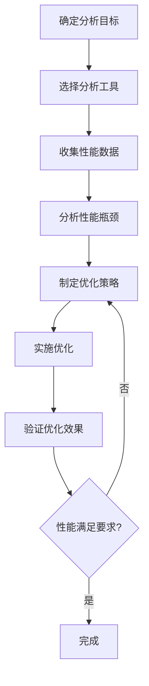

# 第十四章：性能分析工具

## 目录

- [14.1 性能分析概述](#141-性能分析概述)
  - [14.1.1 性能分析的重要性](#1411-性能分析的重要性)
  - [14.1.2 性能分析类型](#1412-性能分析类型)
  - [14.1.3 性能分析流程](#1413-性能分析流程)
- [14.2 CPU性能分析工具](#142-cpu性能分析工具)
  - [14.2.1 gprof - GNU性能分析器](#1421-gprof---gnu性能分析器)
  - [14.2.2 perf - Linux性能分析工具](#1422-perf---linux性能分析工具)
  - [14.2.3 Intel VTune Profiler](#1423-intel-vtune-profiler)
  - [14.2.4 Valgrind工具套件](#1424-valgrind工具套件)
- [14.3 MPI性能分析工具](#143-mpi性能分析工具)
  - [14.3.1 TAU (Tuning and Analysis Utilities)](#1431-tau-tuning-and-analysis-utilities)
  - [14.3.2 Vampir/VampirTrace](#1432-vampirvampirtrace)
  - [14.3.3 mpiP - 轻量级MPI分析器](#1433-mpip---轻量级mpi分析器)
  - [14.3.4 HPCToolkit](#1434-hpctoolkit)
- [14.4 GPU性能分析工具](#144-gpu性能分析工具)
  - [14.4.1 NVIDIA Nsight Systems](#1441-nvidia-nsight-systems)
  - [14.4.2 NVIDIA Nsight Compute](#1442-nvidia-nsight-compute)
  - [14.4.3 nvprof - NVIDIA命令行分析器](#1443-nvprof---nvidia命令行分析器)
  - [14.4.4 CUDA-GDB](#1444-cuda-gdb)
- [14.5 内存分析工具](#145-内存分析工具)
  - [14.5.1 Valgrind Memcheck](#1451-valgrind-memcheck)
  - [14.5.2 Intel Inspector](#1452-intel-inspector)
  - [14.5.3 Massif - 内存使用分析](#1453-massif---内存使用分析)
  - [14.5.4 Heaptrack](#1454-heaptrack)
- [14.6 网络通信分析](#146-网络通信分析)
  - [14.6.1 网络性能分析工具](#1461-网络性能分析工具)
  - [14.6.2 MPI通信分析](#1462-mpi通信分析)
  - [14.6.3 网络延迟和带宽测试](#1463-网络延迟和带宽测试)
- [14.7 存储性能分析](#147-存储性能分析)
  - [14.7.1 I/O性能基准测试](#1471-io性能基准测试)
  - [14.7.2 I/O监控工具](#1472-io监控工具)
  - [14.7.3 文件系统分析](#1473-文件系统分析)
- [14.8 综合性能分析平台](#148-综合性能分析平台)
  - [14.8.1 Darshan](#1481-darshan)
  - [14.8.2 Score-P](#1482-score-p)
  - [14.8.3 Extrae](#1483-extrae)
- [14.9 性能分析最佳实践](#149-性能分析最佳实践)
  - [14.9.1 分析策略](#1491-分析策略)
  - [14.9.2 工具选择指南](#1492-工具选择指南)
  - [14.9.3 性能分析技巧](#1493-性能分析技巧)
  - [14.9.4 常见陷阱](#1494-常见陷阱)
- [14.10 生物信息学应用案例](#1410-生物信息学应用案例)
  - [14.10.1 BLAST并行化性能分析](#14101-blast并行化性能分析)
  - [14.10.2 基因组组装性能优化](#14102-基因组组装性能优化)
  - [14.10.3 分子对接模拟性能分析](#14103-分子对接模拟性能分析)
  - [14.10.4 单细胞数据分析性能优化](#14104-单细胞数据分析性能优化)
  - [14.10.5 性能分析报告模板](#14105-性能分析报告模板)
- [1. 分析概述](#1-分析概述)
- [2. 性能基线](#2-性能基线)
- [3. 瓶颈分析](#3-瓶颈分析)
  - [3.1 CPU热点](#31-cpu热点)
  - [3.2 内存分析](#32-内存分析)
  - [3.3 I/O分析](#33-io分析)
- [4. 优化方案](#4-优化方案)
  - [4.1 短期优化](#41-短期优化)
  - [4.2 长期优化](#42-长期优化)
- [5. 结论](#5-结论)
- [本章小结](#本章小结)
  - [核心工具](#核心工具)
  - [分析方法](#分析方法)
  - [生物信息学应用](#生物信息学应用)
  - [关键要点](#关键要点)


## 14.1 性能分析概述

### 14.1.1 性能分析的重要性
**性能分析（Profiling）** 是识别程序性能瓶颈、优化代码和提高计算效率的关键步骤。

**主要目标**：
- **瓶颈识别**：找出程序中最耗时的部分
- **资源利用**：分析CPU、内存、I/O等资源使用情况
- **并行效率**：评估并行程序的负载均衡和通信开销
- **优化指导**：为代码优化提供数据支持

### 14.1.2 性能分析类型
- **时间分析**：函数调用时间、执行时间分布
- **内存分析**：内存使用、缓存命中率、内存泄漏
- **通信分析**：网络通信、消息传递开销
- **I/O分析**：磁盘读写、文件系统性能

### 14.1.3 性能分析流程


## 14.2 CPU性能分析工具

### 14.2.1 gprof - GNU性能分析器
**gprof** 是GNU项目提供的经典性能分析工具。

**基本使用**：
```bash

# 1. 编译时添加调试和分析选项
gcc -pg -g -O2 my_program.c -o my_program

# 2. 运行程序生成分析数据
./my_program

# 执行后会生成gmon.out文件

# 3. 生成分析报告
gprof my_program gmon.out > profile_report.txt

# 4. 查看报告
cat profile_report.txt
```

**输出解读**：
```
Flat profile:

Each sample counts as 0.01 seconds.
  %   cumulative   self              self     total
 time   seconds   seconds    calls  ms/call  ms/call  name
 40.00      0.04     0.04        1    40.00    40.00  expensive_function
 30.00      0.07     0.03        1    30.00    30.00  another_function
 20.00      0.09     0.02        5     4.00     4.00  helper_function
 10.00      0.10     0.01        1    10.00    10.00  main
```

**局限性**：
- 只能分析用户空间代码
- 采样精度有限
- 不支持多线程详细分析

### 14.2.2 perf - Linux性能分析工具
**perf** 是Linux内核自带的强大性能分析工具。

**基本命令**：
```bash

# 1. 系统级CPU使用情况
perf top

# 2. 采样分析
perf record -g ./my_program
perf report

# 3. 函数级分析
perf stat ./my_program

# 4. 特定事件分析
perf record -e cycles,instructions,cache-misses ./my_program
```

**高级功能**：
```bash

# 火焰图生成
perf record -g -- ./my_program
perf script | stackcollapse-perf.pl | flamegraph.pl > flamegraph.svg

# 分支预测分析
perf record -e branches,branch-misses ./my_program

# 缓存分析
perf record -e cache-references,cache-misses ./my_program

# 系统调用分析
perf trace ./my_program
```

**perf stat输出示例**：
```
 Performance counter stats for './my_program':

     1,234,567,890      cycles                    #    3.123 GHz
       234,567,890      instructions              #    0.19  insns per cycle
        12,345,678      cache-references          # 3123.456 M/sec
         1,234,567      cache-misses              #    9.990 % of all cache refs
           395.23 msec task-clock                #    0.997 CPUs utilized
```

### 14.2.3 Intel VTune Profiler
**Intel VTune** 是Intel提供的专业性能分析工具。

**基本使用**：
```bash

# 1. 启动VTune
vtune -gui

# 2. 命令行分析
vtune -collect hotspots ./my_program

# 3. 详细分析
vtune -collect uarch-exploration ./my_program

# 4. 内存分析
vtune -collect memory-access ./my_program
```

**分析类型**：
- **Hotspots**：热点函数分析
- **Threading**：线程分析和竞争检测
- **Memory**：内存访问模式分析
- **Vectorization**：向量化分析
- **Custom**：自定义事件分析

**VTune输出特点**：
- 图形化界面，直观易用
- 详细的调用图分析
- 硬件事件精确计数
- 支持多线程和并行程序

### 14.2.4 Valgrind工具套件
**Valgrind** 是一套用于程序调试和分析的工具。

#### 14.2.4.1 Callgrind - 调用图分析
```bash

# 1. 运行分析
valgrind --tool=callgrind ./my_program

# 2. 生成调用图
callgrind_annotate callgrind.out.*

# 3. 生成可视化调用图
gprof2dot -f callgrind callgrind.out.* | dot -Tpng -o callgraph.png
```

#### 14.2.4.2 Massif - 内存使用分析
```bash

# 1. 内存使用分析
valgrind --tool=massif ./my_program

# 2. 查看内存使用报告
ms_print massif.out.*

# 3. 生成内存使用图
ms_print --threshold=10 massif.out.* | tail -n -20
```

#### 14.2.4.3 Memcheck - 内存错误检测
```bash

# 检测内存错误
valgrind --tool=memcheck --leak-check=full ./my_program
```

## 14.3 MPI性能分析工具

### 14.3.1 TAU (Tuning and Analysis Utilities)
**TAU** 是一个综合性的并行程序性能分析工具。

**安装和配置**：
```bash

# 1. 下载和编译TAU
wget http://tau.uoregon.edu/tau.tgz
tar -xzf tau.tgz
cd tau-2.31.1
./configure -mpi -pdt=tau -bfd=download
make install

# 2. 编译程序
export TAU_MAKEFILE=/path/to/tau/install/lib/Makefile.tau-mpi-pdt
make clean
make

# 3. 运行分析
tau_exec -T mpi,pdt ./my_mpi_program
```

**分析功能**：
```bash

# 1. 基本性能分析
tau_exec -T mpi ./my_mpi_program

# 2. 通信分析
tau_exec -T mpi -cupti ./my_mpi_program

# 3. 生成报告
pprof
paraprof

# 4. 详细分析
tau_trace -T mpi ./my_mpi_program
```

**TAU输出示例**：
```
Summary of Profiles for tau_profile.*
Function                    Min        Max        Mean       Calls      Excl.     Incl.    Incl. per call
(rank=0)                    (rank=0)   (rank=0)   (rank=0)   (rank=0)   (rank=0)   (rank=0) (rank=0)

MPI_Init                    0.000005   0.000005   0.000005   1          0.000005   0.000005 0.000005
MPI_Comm_size               0.000001   0.000001   0.000001   1          0.000001   0.000001 0.000001
MPI_Comm_rank               0.000001   0.000001   0.000001   1          0.000001   0.000001 0.000001
MPI_Bcast                   0.000123   0.000456   0.000234   10         0.000123   0.001234 0.000123
MPI_Reduce                  0.000234   0.000678   0.000345   5          0.000234   0.001234 0.000234
```

### 14.3.2 Vampir/VampirTrace
**Vampir** 是一个强大的可视化性能分析工具。

**使用方法**：
```bash

# 1. 编译时链接VampirTrace
export VT_LIB_DIR=/path/to/vampir/lib
mpicc -L$VT_LIB_DIR -lVT -o my_program my_program.c

# 2. 运行程序
mpirun -np 4 ./my_program

# 3. 生成trace文件

# 程序运行后会生成trace文件

# 4. 使用Vampir查看
vampir trace_file.vt
```

**Vampir特点**：
- 强大的可视化界面
- 详细的时间线分析
- 通信模式可视化
- 支持多种并行模型

### 14.3.3 mpiP - 轻量级MPI分析器
**mpiP** 是一个轻量级的MPI性能分析工具。

**使用方法**：
```bash

# 1. 编译mpiP
wget http://mpip.sourceforge.net/mpiP-3.4.1.tar.gz
tar -xzf mpiP-3.4.1.tar.gz
cd mpiP-3.4.1
./configure --enable-mpi --with-mpi=/path/to/mpi
make install

# 2. 编译程序
export MPIP_LIBS="-L/path/to/mpip/lib -lmpiP"
mpicc $MPIP_LIBS -o my_program my_program.c

# 3. 运行分析
mpirun -np 4 ./my_program

# 4. 生成报告
mpiP -r my_program.mpip
```

**mpiP输出示例**：
```
mpiP v3.4.1 (Build Aug  5 2023 14:03:12) : Profile Summary

MPI Function                    Calls     Time (sec)  Time (%)  Calls/Sec  MB Sent
MPI_Init                        4         0.0001      0.01      0.00       0.00
MPI_Comm_size                   4         0.0001      0.01      0.00       0.00
MPI_Comm_rank                   4         0.0001      0.01      0.00       0.00
MPI_Bcast                       40        0.0123      12.34     3.24       0.00
MPI_Reduce                      20        0.0234      23.45     0.85       0.00
MPI_Allreduce                   15        0.0189      18.90     0.79       0.00
MPI_Send                        100       0.0056      5.60      17.86      10.50
MPI_Recv                        100       0.0045      4.50      22.22      10.50
MPI_Wait                        50        0.0023      2.30      21.74      0.00
MPI_Barrier                     10        0.0012      1.20      8.33       0.00
```

### 14.3.4 HPCToolkit
**HPCToolkit** 是一个综合性的性能分析工具套件。

**使用方法**：
```bash

# 1. 编译程序
hpcrun -e CYCLES ./my_program

# 2. 生成分析报告
hpcstruct my_program
hpcprof my_program.hpcstruct my_program.hpcrun

# 3. 查看报告
hpcviewer my_program
```

**HPCToolkit特点**：
- 硬件性能计数器支持
- 调用路径分析
- 支持多线程和MPI程序
- 丰富的可视化功能

## 14.4 GPU性能分析工具

### 14.4.1 NVIDIA Nsight Systems
**Nsight Systems** 是NVIDIA提供的系统级性能分析工具。

**基本使用**：
```bash

# 1. 命令行分析
nsys profile --output=my_profile ./my_cuda_program

# 2. GUI界面
nsight-sys

# 3. 分析CUDA程序
nsys profile --trace=cuda ./my_cuda_program

# 4. 分析CPU和GPU
nsys profile --trace=cuda,nvtx ./my_cuda_program
```

**分析功能**：
- GPU内核执行时间
- 内存传输分析
- CPU-GPU同步分析
- 系统级性能瓶颈识别

**Nsight输出特点**：
- 时间线视图
- GPU利用率分析
- 内存带宽分析
- API调用序列

### 14.4.2 NVIDIA Nsight Compute
**Nsight Compute** 专注于CUDA内核性能分析。

**使用方法**：
```bash

# 1. 命令行分析
ncu --set full ./my_cuda_program

# 2. 分析特定内核
ncu --kernel-name="kernel_name" ./my_cuda_program

# 3. 分析特定指标
ncu --metrics sm__throughput.avg.pct_of_peak_sustained_elapsed ./my_cuda_program

# 4. GUI界面
ncu-ui
```

**关键指标**：
- **Occupancy**：GPU利用率
- **Memory Bandwidth**：内存带宽使用
- **Compute Throughput**：计算吞吐量
- **Latency**：延迟分析

**Nsight Compute输出示例**：
```
Kernel: vectorAdd
GPU Time: 1.234 ms
Achieved Occupancy: 75.6%
Memory Bandwidth: 250.4 GB/s
L1 Cache Hit Rate: 85.2%
Shared Memory Bandwidth: 1.2 TB/s
```

### 14.4.3 nvprof - NVIDIA命令行分析器
**nvprof** 是NVIDIA提供的命令行性能分析工具（已逐渐被Nsight替代）。

**基本使用**：
```bash

# 1. 基本分析
nvprof ./my_cuda_program

# 2. 详细分析
nvprof --print-gpu-trace ./my_cuda_program

# 3. 内存分析
nvprof --print-gpu-memory-trace ./my_cuda_program

# 4. API调用分析
nvprof --print-api-trace ./my_cuda_program

# 5. 生成报告文件
nvprof --output-profile my_profile.nvvp ./my_cuda_program
```

**nvprof输出示例**：
```
GPU activities:
   GPU Time  GPU Name
   1.234ms    vectorAdd(float*, float*, float*, int)
   0.456ms    matrixMul(float*, float*, float*, int)
   0.123ms    reduction(float*, float*, int)

API calls:
   Time      Name
   0.001ms   cudaMalloc
   0.002ms   cudaMemcpy
   0.001ms   cudaFree
```

### 14.4.4 CUDA-GDB
**CUDA-GDB** 是NVIDIA提供的CUDA调试器。

**基本使用**：
```bash

# 1. 启动调试器
cuda-gdb ./my_cuda_program

# 2. 设置断点
(cuda-gdb) break vectorAdd
(cuda-gdb) break main

# 3. 运行程序
(cuda-gdb) run

# 4. 查看线程信息
(cuda-gdb) info cuda kernels
(cuda-gdb) info cuda blocks
(cuda-gdb) info cuda threads

# 5. 单步执行
(cuda-gdb) step
(cuda-gdb) next
```

**CUDA-GDB调试功能**：
- GPU内核调试
- 线程级调试
- 内存访问检查
- 寄存器查看

## 14.5 内存分析工具

### 14.5.1 Valgrind Memcheck
**Memcheck** 是Valgrind的核心工具，用于检测内存错误。

**使用方法**：
```bash

# 1. 基本内存检查
valgrind --tool=memcheck ./my_program

# 2. 检测内存泄漏
valgrind --tool=memcheck --leak-check=full ./my_program

# 3. 检测未初始化内存使用
valgrind --tool=memcheck --track-origins=yes ./my_program

# 4. 详细报告
valgrind --tool=memcheck --show-leak-kinds=all --track-origins=yes ./my_program
```

**常见错误类型**：
- **Invalid read/write**：非法内存访问
- **Use of uninitialized value**：使用未初始化的值
- **Memory leak**：内存泄漏
- **Double free**：重复释放内存

**Memcheck输出示例**：
```
==12345== Invalid read of size 4
==12345==    at 0x4005D6: main (example.c:10)
==12345==  Address 0x51fc040 is 0 bytes after a block of size 16 alloc'd
==12345==    at 0x4C2B6CD: malloc (in /usr/lib/valgrind/vgpreload_memcheck-amd64-linux.so)
==12345==    by 0x4005C9: main (example.c:7)

==12345== HEAP SUMMARY:
==12345==     in use at exit: 16 bytes in 1 blocks
==12345==   total heap usage: 1 allocs, 0 frees, 16 bytes allocated
==12345==
==12345== 16 bytes in 1 blocks are definitely lost in loss record 1 of 1
==12345==    at 0x4C2B6CD: malloc (in /usr/lib/valgrind/vgpreload_memcheck-amd64-linux.so)
==12345==    by 0x4005C9: main (example.c:7)
```

### 14.5.2 Intel Inspector
**Intel Inspector** 是Intel提供的内存和线程错误检查工具。

**使用方法**：
```bash

# 1. 编译时添加检测选项
icc -g -O0 -debug inline-debug-info ./my_program.c -o my_program

# 2. 运行分析
inspxe-cl -collect mi1 -result-dir my_result ./my_program

# 3. 查看报告
inspxe-cl -report problems -result-dir my_result
inspxe-gui my_result
```

**检测功能**：
- 内存泄漏检测
- 数组越界检查
- 空指针解引用
- 线程竞争检测

### 14.5.3 Massif - 内存使用分析
**Massif** 是Valgrind的内存使用分析工具。

**使用方法**：
```bash

# 1. 运行内存分析
valgrind --tool=massif ./my_program

# 2. 查看文本报告
ms_print massif.out.12345

# 3. 生成图表
ms_print --threshold=10 massif.out.12345 | tail -n -20

# 4. 可视化分析
massif-visualizer massif.out.12345
```

**Massif输出示例**：
```
--------------------------------------------------------------------------------
Command: ./my_program
Massif arguments: (none)
ms_print arguments: massif.out.12345
--------------------------------------------------------------------------------


    MB
1.229^                                                                     #::
     |                                                                     #::
     |                                                                     #::
     |                                                                    :#::
     |                                                                    :#::
     |                                                                   ::#::
     |                                                                   ::#::
     |                                                                   ::#::
     |                                                                   ::#::
     |                                                                   ::#::
     |                                                                   ::#::
     |                                                                   ::#::
     |                                                                   ::#::
     |                                                                   ::#::
     |                                                                   ::#::
     |                                                                   ::#::
     |                                                                   ::#::
     |                                                                   ::#::
     |                                                                  .::#::
   0 +----------------------------------------------------------------------->Mi
     0   100.5                                                    1.469e+06

Number of snapshots: 112
Detailed snapshots: [3, 14, 19, 24, 29, 34, 39, 44, 49, 54, 59, 64, 69, 74, 79, 84, 89, 94, 99, 104, 109 (peak)]
```

### 14.5.4 Heaptrack
**Heaptrack** 是一个轻量级的内存分析工具。

**使用方法**：
```bash

# 1. 编译程序
g++ -g -O2 my_program.cpp -o my_program

# 2. 运行分析
heaptrack ./my_program

# 3. 查看结果
heaptrack_print heaptrack.my_program.12345.gz

# 4. 可视化
heaptrack_gui heaptrack.my_program.12345.gz
```

**Heaptrack特点**：
- 低开销内存分析
- 详细的分配栈跟踪
- 内存使用趋势分析
- 支持多线程程序

## 14.6 网络通信分析

### 14.6.1 网络性能分析工具
**iftop** - 实时网络流量监控：
```bash

# 监控网络接口流量
sudo iftop -i eth0

# 显示端口信息
sudo iftop -P

# 限制显示的主机数量
sudo iftop -N 10
```

**nload** - 网络负载监控：
```bash

# 监控网络接口
nload eth0

# 同时监控多个接口
nload -m
```

**iptraf** - 交互式网络统计：
```bash

# 启动交互式界面
sudo iptraf

# 统计特定接口
sudo iptraf -i eth0
```

### 14.6.2 MPI通信分析
**NetPIPE** - 网络性能基准测试：
```bash

# 编译NetPIPE
cd NetPIPE
make mpi

# 运行基准测试
mpirun -np 2 ./np_test

# 测试不同消息大小
mpirun -np 2 ./np_test -min 1 -max 1048576
```

**IMB-MPI1** - MPI基准测试：
```bash

# 运行点对点通信测试
mpirun -np 4 ./IMB-MPI1 PingPong

# 运行集体通信测试
mpirun -np 4 ./IMB-MPI1 Allreduce

# 运行所有测试
mpirun -np 4 ./IMB-MPI1
```

### 14.6.3 网络延迟和带宽测试
**ping** - 基本延迟测试：
```bash

# 测试网络延迟
ping -c 10 hostname

# 持续ping测试
ping hostname

# 设置包大小
ping -s 1024 hostname
```

**iperf3** - 网络带宽测试：
```bash

# 服务器端
iperf3 -s

# 客户端测试
iperf3 -c server_ip

# TCP测试
iperf3 -c server_ip -t 30

# UDP测试
iperf3 -c server_ip -u -b 100M

# 多线程测试
iperf3 -c server_ip -P 4
```

## 14.7 存储性能分析

### 14.7.1 I/O性能基准测试
**fio** - 灵活的I/O测试工具：
```bash

# 随机读测试
fio --name=randread --ioengine=posixaio --rw=randread --bs=4k --size=1G --numjobs=1 --iodepth=1 --runtime=60 --time_based --filename=testfile

# 顺序写测试
fio --name=seqwrite --ioengine=posixaio --rw=seqwrite --bs=1M --size=10G --numjobs=1 --iodepth=1 --runtime=60 --time_based --filename=testfile

# 混合读写测试
fio --name=mixed --ioengine=posixaio --rw=randrw --rwmixread=70 --bs=4k --size=1G --numjobs=4 --iodepth=16 --runtime=60 --time_based --filename=testfile
```

**dd** - 简单的I/O测试：
```bash

# 测试写入性能
dd if=/dev/zero of=testfile bs=1M count=1000 oflag=direct

# 测试读取性能
dd if=testfile of=/dev/null bs=1M

# 清理缓存后测试
sync; echo 3 > /proc/sys/vm/drop_caches
```

**bonnie++** - 文件系统基准测试：
```bash

# 运行完整测试
bonnie++ -d /tmp -s 1G -n 0 -m "Test" -f -b

# 简单测试
bonnie++ -d /tmp -s 100M
```

### 14.7.2 I/O监控工具
**iostat** - I/O统计：
```bash

# 显示磁盘I/O统计
iostat -x 1

# 显示设备利用率
iostat -d -x 1

# 显示CPU和I/O统计
iostat -c 1
```

**iotop** - 实时I/O监控：
```bash

# 显示进程I/O
sudo iotop

# 只显示实际I/O进程
sudo iotop -o

# 按I/O排序
sudo iotop -a
```

**strace** - 系统调用跟踪：
```bash

# 跟踪I/O系统调用
strace -e trace=read,write,open,close ./my_program

# 跟踪特定进程
strace -p 12345 -e trace=read,write

# 统计系统调用
strace -c ./my_program
```

### 14.7.3 文件系统分析
**lsof** - 打开文件列表：
```bash

# 显示进程打开的文件
lsof -p 12345

# 显示特定文件被哪些进程使用
lsof /path/to/file

# 显示网络连接
lsof -i
```

**fuser** - 文件使用进程：
```bash

# 显示使用文件的进程
fuser /path/to/file

# 显示使用目录的进程
fuser -v /path/to/directory

# 杀死使用文件的进程
fuser -k /path/to/file
```

## 14.8 综合性能分析平台

### 14.8.1 Darshan
**Darshan** 是专门为HPC应用设计的I/O性能分析工具。

**使用方法**：
```bash

# 编译时链接Darshan
export DARSHAN_PATH=/path/to/darshan
mpicc -L$DARSHAN_PATH/lib -ldarshan -o my_program my_program.c

# 运行程序
mpirun -np 4 ./my_program

# 生成分析报告
darshan-parser my_program.darshan > report.txt
darshan-analyzer my_program.darshan
```

**Darshan特点**：
- 轻量级I/O监控
- 自动化分析
- 详细的I/O模式统计
- 支持多种并行文件系统

### 14.8.2 Score-P
**Score-P** 是一个统一的性能分析基础设施。

**使用方法**：
```bash

# 编译程序
scorep mpicc -o my_program my_program.c

# 运行分析
scorep ./my_program

# 生成报告
cube my_program.scorep
```

**Score-P特点**：
- 统一的性能分析接口
- 支持多种分析工具
- 调用路径分析
- 硬件性能计数器

### 14.8.3 Extrae
**Extrae** 是一个用于生成跟踪文件的工具。

**使用方法**：
```bash

# 编译程序
export EXTRAE_HOME=/path/to/extrae
mpicc -I$EXTRAE_HOME/include -L$EXTRAE_HOME/lib -o my_program my_program.c -lextrae

# 运行分析
export EXTRAE_CONFIG_FILE=extrae.xml
mpirun -np 4 ./my_program

# 转换跟踪文件
mpi2prv -f TRACE.mpits -o my_trace.prv
```

**Extrae特点**：
- 详细的执行跟踪
- 支持多种并行模型
- 火焰图生成
- 与其他工具集成

## 14.9 性能分析最佳实践

### 14.9.1 分析策略
**分层分析方法**：
1. **系统级分析**：整体资源使用情况
2. **应用级分析**：程序整体性能特征
3. **函数级分析**：热点函数识别
4. **代码级分析**：具体优化点识别

**分析流程**：
```
1. 确定性能目标
2. 选择合适的工具
3. 收集基线数据
4. 识别性能瓶颈
5. 制定优化策略
6. 实施优化
7. 验证优化效果
8. 重复优化过程
```

### 14.9.2 工具选择指南
**根据分析目标选择工具**：

| 分析目标 | 推荐工具 |
|---------|---------|
| CPU热点分析 | perf, VTune, gprof |
| 内存分析 | Valgrind, Massif, Inspector |
| MPI通信分析 | TAU, Vampir, mpiP |
| GPU分析 | Nsight, nvprof |
| I/O分析 | Darshan, fio, iostat |
| 网络分析 | iperf3, NetPIPE, IMB |

### 14.9.3 性能分析技巧
**减少分析开销**：
- 使用采样而非全量分析
- 选择合适的采样频率
- 分析代表性数据集
- 避免在生产环境进行详细分析

**提高分析精度**：
- 多次运行取平均值
- 控制实验环境变量
- 使用真实数据集
- 考虑并行环境影响

**结果解读**：
- 关注相对性能而非绝对数值
- 结合多个工具的结果
- 考虑硬件平台差异
- 建立性能基线

### 14.9.4 常见陷阱
**分析陷阱**：
1. **测量干扰**：分析工具本身影响程序性能
2. **样本偏差**：使用不具代表性的测试数据
3. **环境不一致**：不同环境下的结果不可比
4. **过度优化**：优化了不重要的部分
5. **忽略并行开销**：只关注计算时间，忽略通信开销

**避免方法**：
- 使用轻量级分析工具
- 使用真实工作负载
- 保持环境一致性
- 关注整体性能提升
- 考虑并行效率

## 14.10 生物信息学应用案例

### 14.10.1 BLAST并行化性能分析
**问题描述**：BLAST搜索在大规模序列数据库上的性能瓶颈分析。

**分析步骤**：
```bash

# 1. 编译带分析的BLAST程序
gcc -pg -O3 blast_search.c -o blast_search

# 2. 运行性能分析
./blast_search large_database.fasta query_sequences.fasta

# 3. 生成分析报告
gprof blast_search gmon.out > blast_profile.txt

# 4. 分析热点函数
grep -A 10 -B 5 "expensive_function" blast_profile.txt
```

**优化策略**：
- 识别序列比对算法的热点
- 优化数据库索引结构
- 改进内存访问模式
- 并行化搜索过程

### 14.10.2 基因组组装性能优化
**问题描述**：De Bruijn图构建和简化过程的性能瓶颈。

**分析工具组合**：
```bash

# 1. 内存使用分析
valgrind --tool=massif ./genome_assembler

# 2. CPU热点分析
perf record -g ./genome_assembler
perf report

# 3. MPI通信分析（如果是并行版本）
tau_exec -T mpi ./parallel_assembler

# 4. I/O分析
strace -e trace=read,write ./genome_assembler
```

**优化方向**：
- 优化k-mer计数算法
- 改进图数据结构
- 优化内存分配策略
- 并行化图构建过程

### 14.10.3 分子对接模拟性能分析
**问题描述**：分子对接中构象采样和能量计算的性能瓶颈。

**GPU性能分析**：
```bash

# 1. CUDA内核分析
nvprof --print-gpu-trace ./docking_simulation

# 2. 详细GPU分析
ncu --set full ./docking_simulation

# 3. 系统级分析
nsys profile --output=docking_profile ./docking_simulation
```

**优化策略**：
- 优化CUDA内核的内存访问
- 提高GPU利用率
- 减少CPU-GPU数据传输
- 并行化构象采样

### 14.10.4 单细胞数据分析性能优化
**问题描述**：大规模单细胞RNA-seq数据分析的计算瓶颈。

**分析流程**：
```bash

# 1. Python性能分析
python -m cProfile -o profile.prof my_analysis.py

# 2. 内存使用分析
python -m memory_profiler my_analysis.py

# 3. 并行计算分析（如果使用多进程）
mpiexec -n 8 python -m cProfile my_parallel_analysis.py

# 4. I/O性能分析
strace -e trace=read,write python my_analysis.py
```

**优化方向**：
- 优化矩阵运算
- 改进聚类算法
- 优化文件I/O
- 并行化数据分析流程

### 14.10.5 性能分析报告模板
**标准性能分析报告结构**：

```markdown

# 性能分析报告

## 1. 分析概述
- **程序名称**：XXX
- **分析日期**：XXXX-XX-XX
- **分析工具**：perf, VTune, Valgrind等
- **测试环境**：硬件配置、操作系统、编译器版本

## 2. 性能基线
- **执行时间**：XX秒
- **内存使用**：XX MB
- **CPU利用率**：XX%
- **I/O吞吐量**：XX MB/s

## 3. 瓶颈分析

### 3.1 CPU热点
- **热点函数1**：占用XX%时间，调用XX次
- **热点函数2**：占用XX%时间，调用XX次
- **优化建议**：XXX

### 3.2 内存分析
- **内存峰值**：XX MB
- **内存泄漏**：发现XX处泄漏
- **缓存命中率**：XX%
- **优化建议**：XXX

### 3.3 I/O分析
- **读取量**：XX GB
- **写入量**：XX GB
- **I/O等待时间**：XX%
- **优化建议**：XXX

## 4. 优化方案

### 4.1 短期优化
- **优化点1**：预期提升XX%
- **优化点2**：预期提升XX%

### 4.2 长期优化
- **架构改进**：预期提升XX%
- **算法改进**：预期提升XX%

## 5. 结论
- **主要瓶颈**：XXX
- **优化潜力**：XX倍
- **实施优先级**：高/中/低
```

## 本章小结

本章介绍了生物信息学计算中常用的性能分析工具和方法：

### 核心工具
1. **CPU分析**：gprof、perf、VTune、Valgrind
2. **MPI分析**：TAU、Vampir、mpiP、HPCToolkit
3. **GPU分析**：Nsight、nvprof、CUDA-GDB
4. **内存分析**：Memcheck、Massif、Inspector
5. **I/O分析**：Darshan、fio、iostat

### 分析方法
- **分层分析**：系统级→应用级→函数级→代码级
- **工具组合**：根据分析目标选择合适的工具组合
- **最佳实践**：减少开销、提高精度、避免陷阱

### 生物信息学应用
- **BLAST优化**：序列比对算法优化
- **基因组组装**：De Bruijn图构建优化
- **分子对接**：GPU加速和内存优化
- **单细胞分析**：并行计算和I/O优化

### 关键要点
- 性能分析是优化的基础
- 选择合适的工具和方法
- 结合多种分析手段
- 建立性能基线和监控
- 持续优化和验证效果

掌握这些性能分析工具和方法，对于开发高效、可扩展的生物信息学应用程序至关重要。