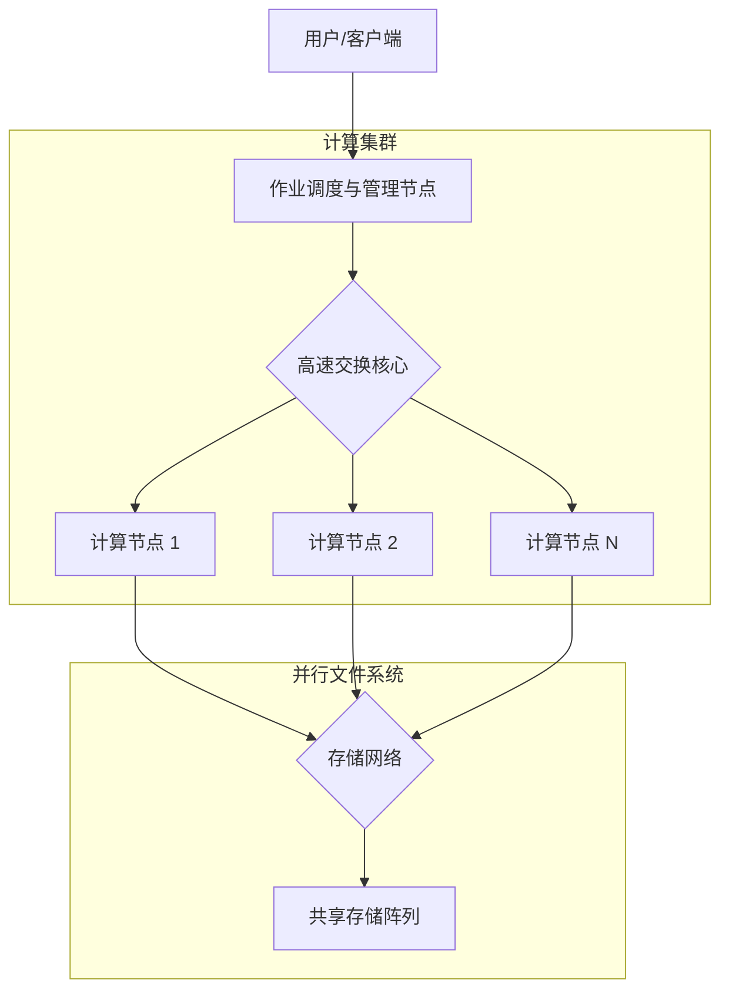

# 第四章 高性能计算架构

## 目录

- [4.1 超级计算机架构](#4.1-超级计算机架构)
  - [4.1.1 超级计算机概述](#4.1.1-超级计算机概述)
  - [4.1.2 集群系统](#4.1.2-集群系统)
  - [4.1.3 大规模并行处理器 (MPP)](#4.1.3-大规模并行处理器-mpp)
  - [4.1.4 向量处理器](#4.1.4-向量处理器)
  - [4.1.5 异构计算系统](#4.1.5-异构计算系统)
- [4.2 存储层次结构](#4.2-存储层次结构)
  - [4.2.1 存储层次概述](#4.2.1-存储层次概述)
  - [4.2.2 寄存器与指令级并行](#4.2.2-寄存器与指令级并行)
  - [4.2.3 缓存系统与优化](#4.2.3-缓存系统与优化)
  - [4.2.4 主内存与NUMA架构](#4.2.4-主内存与numa架构)
  - [4.2.5 分层存储系统](#4.2.5-分层存储系统)
- [4.3 互连网络](#4.3-互连网络)
  - [4.3.1 网络拓扑基础](#4.3.1-网络拓扑基础)
  - [4.3.2 经典拓扑：网格与超立方体](#4.3.2-经典拓扑网格与超立方体)
  - [4.3.3 现代数据中心拓扑：胖树](#4.3.3-现代数据中心拓扑胖树)
  - [4.3.4 高性能互连技术：InfiniBand](#4.3.4-高性能互连技术infiniband)
- [4.4 处理器架构](#4.4-处理器架构)
  - [4.4.1 多核处理器](#4.4.1-多核处理器)
  - [4.4.2 众核处理器](#4.4.2-众核处理器)
  - [4.4.3 GPU架构](#4.4.3-gpu架构)
  - [4.4.4 编程模型与异构协作](#4.4.4-编程模型与异构协作)
- [4.5 本章小结](#4.5-本章小结)
- [练习题](#练习题)

---

## 4.1 超级计算机架构

### 4.1.1 超级计算机概述

超级计算机（Supercomputer）代表了当前计算机科学与工程的最高水平，能够执行通用计算机无法处理的大规模、高复杂度计算任务。它们是国家科技竞争力的重要标志，广泛应用于气象预报、核能模拟、生命科学、天体物理以及近年来兴起的大规模人工智能模型训练。

随着技术的发展，超级计算机的架构已从早期的单处理器向量机演变为如今拥有数百万个计算核心的大规模并行系统。

### 4.1.2 集群系统

#### 概念与特点

集群系统（Cluster System）是目前最主流的超级计算机架构。它通过高速网络将多台独立的计算机（节点）连接起来，在系统层面表现为一个统一的计算资源。

**核心架构特点**：
- **松耦合（Loosely Coupled）**：每个节点拥有独立的操作系统、内存和处理器，节点间通过消息传递进行通信。
- **高可扩展性（Scalability）**：可以通过增加节点数量线性提升计算能力，现代集群可扩展至数万个节点。
- **高可用性（High Availability）**：通过软件层面的容错机制，单个节点的故障不会导致整个计算任务的失败。
- **高性价比**：大量采用商用现货（COTS）硬件，如x86处理器和标准加速卡，降低了构建成本。

#### 集群架构示意图



#### 实际集群配置示例

以TOP500超级计算机为例，一个典型的计算节点配置可能如下：

```bash
# 典型的计算节点硬件配置
# CPU: 2x AMD EPYC 9654 (96 cores each)
# RAM: 512GB DDR5 ECC
# Interconnect: NVIDIA InfiniBand NDR (400Gb/s)
# Accelerator: 4x NVIDIA H100 GPU
# Local Storage: 2TB NVMe SSD (用于暂存)
```

#### 集群管理与调度

集群的高效运行依赖于作业调度系统（如Slurm, PBS）和资源管理器。

**Slurm 作业脚本示例**：

```bash
#!/bin/bash
#SBATCH --job-name=deep_learning_training
#SBATCH --nodes=4                   # 申请4个节点
#SBATCH --ntasks-per-node=8         # 每个节点运行8个任务（对应GPU数）
#SBATCH --gres=gpu:8                # 申请GPU资源
#SBATCH --time=12:00:00             # 预计运行时间
#SBATCH --partition=gpu_prio        # 提交到高优先级分区
#SBATCH --output=logs/train_%j.log  # 日志输出

# 加载环境模块
module purge
module load cuda/12.0
module load openmpi/4.1

# 打印节点信息
echo "Running on hosts: $(scontrol show hostnames $SLURM_JOB_NODELIST)"

# 启动分布式训练任务
mpirun -np 32 python3 train_model.py --config config.yaml
```

**Python 简易资源管理器模拟**：

```python
class ClusterResourceManager:
    """模拟集群资源分配逻辑"""
    def __init__(self, nodes):
        self.nodes = nodes
        self.node_status = {node: 'idle' for node in nodes}
        # 模拟各节点的资源负载 (CPU, Memory)
        self.node_resources = {node: {'cpu': 100, 'mem': 100} for node in nodes}

    def allocate_resources(self, job_req):
        """尝试为作业分配节点"""
        allocated_nodes = []
        required_nodes = job_req['nodes']
        
        for node, status in self.node_status.items():
            if status == 'idle':
                # 检查资源是否满足要求
                if self.check_capacity(node, job_req):
                    allocated_nodes.append(node)
            
            if len(allocated_nodes) == required_nodes:
                break
        
        if len(allocated_nodes) == required_nodes:
            self._commit_allocation(allocated_nodes)
            return allocated_nodes
        return None

    def check_capacity(self, node, req):
        # 简化的容量检查
        return True 

    def _commit_allocation(self, nodes):
        for node in nodes:
            self.node_status[node] = 'busy'
            print(f"Node {node} allocated.")
```

### 4.1.3 大规模并行处理器 (MPP)

#### MPP架构特点

大规模并行处理器（Massively Parallel Processor, MPP）是一种更紧密集成的架构。与集群不同，MPP通常采用定制化的互连网络和专有的操作系统内核，以实现极低的通信延迟和极高的带宽。

**核心特征**：
- **物理上分布，逻辑上独立**：虽然也是分布式内存，但硬件集成度极高。
- **高性能互连**：采用私有协议的高速网络（如Cray Aries/Slingshot），不仅带宽大，而且延迟极低。
- **单一系统映像**：对用户而言，MPP系统往往表现得更像一台巨大的单一计算机，而不是一堆独立的服务器。

#### MPP与集群的对比

| 特性 | MPP (Massively Parallel Processor) | Cluster (集群) |
| :--- | :--- | :--- |
| **互连网络** | 专用、高带宽、低延迟定制网络 | 商用网络 (Ethernet, InfiniBand) |
| **操作系统** | 专有或定制微内核 | 标准操作系统 (Linux) |
| **扩展性** | 极高 (可达数十万核) | 高 (受限于网络与管理开销) |
| **成本** | 极其昂贵 | 相对低廉 |
| **应用场景** | 顶级气象模拟、核武器模拟 | 通用科学计算、Web服务、大数据 |

### 4.1.4 向量处理器

向量处理器（Vector Processor）通过单指令流操作多数据流（SIMD）来提高性能。它拥有一组专门的向量寄存器，一条指令可以对一组数据（向量）同时进行操作。虽然纯粹的向量超级计算机（如早期的Cray-1）已不多见，但向量处理技术已深深融入现代CPU（AVX-512指令集）和GPU中。

**向量运算原理**：

传统的标量运算：
$$ C[i] = A[i] + B[i] $$ (需循环N次)

向量运算：
$$ \vec{C} = \vec{A} + \vec{B} $$ (单次指令处理多个元素)

### 4.1.5 异构计算系统

随着摩尔定律的放缓，异构计算成为提升算力的关键。异构系统在同一平台中集成不同架构的计算单元，通常是 **"CPU + 加速器"** 的模式。

- **CPU (Host)**: 负责复杂的逻辑控制、操作系统运行、I/O调度。
- **加速器 (Device)**: 负责计算密集型任务。常见加速器包括：
  - **GPU**: 擅长大规模数据并行。
  - **FPGA**: 可编程逻辑，适合流处理和特定算法硬件化。
  - **ASIC (如TPU)**: 针对特定应用（如深度学习）定制的芯片。

## 4.2 存储层次结构

### 4.2.1 存储层次概述

存储墙（Memory Wall）是限制高性能计算的主要瓶颈。为了平衡容量、速度和成本，计算机系统构建了金字塔式的存储层次结构。

```mermaid
graph TD
    Reg["寄存器 (Registers)"] --> L1[L1 缓存]
    L1 --> L2[L2 缓存]
    L2 --> L3[L3 缓存 (共享)]
    L3 --> DRAM[主内存 (DRAM)]
    DRAM --> NVMe[本地 NVMe SSD]
    NVMe --> PFS[并行文件系统 (Lustre/GPFS)]
    PFS --> Archive[冷数据归档 (磁带)]
    
    style Reg fill:#f9f,stroke:#333
    style DRAM fill:#ccf,stroke:#333
    style PFS fill:#ff9,stroke:#333
```

### 4.2.2 寄存器与指令级并行

寄存器是距离ALU最近的存储单元。编译器会通过**寄存器分配算法**（如图着色算法）尽可能将高频变量驻留在寄存器中。

**优化示例：利用寄存器减少内存访问**

```cpp
void register_optimization_example(float* data, int n) {
    // 使用局部变量（通常分配在寄存器）累加
    register float partial_sum = 0.0f; 
    
    for (int i = 0; i < n; i++) {
        partial_sum += data[i];
    }
    
    // 循环结束后再一次性写回内存
    global_result = partial_sum; 
}
```

### 4.2.3 缓存系统与优化

缓存（Cache）利用了程序的**时间局部性**和**空间局部性**。

- **L1 Cache**: 核心私有，分为指令(I-Cache)和数据(D-Cache)。
- **L2 Cache**: 核心私有或两核共享，延迟略高。
- **L3 Cache (LLC)**: 所有核心共享，用于核心间数据交换。

**关键优化：避免伪共享 (False Sharing)**

当两个线程修改不同变量，但这些变量位于同一个缓存行（Cache Line，通常64字节）时，会导致缓存一致性协议频繁失效，严重降低性能。

```cpp
// 伪共享问题示例
struct BadStruct {
    std::atomic<int> counter_a; // 线程A修改
    std::atomic<int> counter_b; // 线程B修改
    // counter_a 和 counter_b 极可能在同一缓存行
};

// 优化：通过填充（Padding）强制隔离
struct alignas(64) GoodStruct {
    std::atomic<int> counter_a;
    char padding[64 - sizeof(std::atomic<int>)]; // 填充至缓存行边界
    std::atomic<int> counter_b;
};
```

### 4.2.4 主内存与NUMA架构

在多路服务器中，非统一内存访问（NUMA）架构是标配。每个CPU插槽有自己的本地内存。访问本地内存极快，访问远程（另一CPU的）内存则较慢且经过互连总线。

**NUMA 优化策略**：
1. **First-touch 策略**：操作系统通常在内存第一次被写入时分配物理页。确保由通过计算该数据的线程来初始化数据。
2. **线程绑定 (Pinning)**：将线程绑定到特定的CPU核心，防止线程在不同NUMA节点间漂移。

### 4.2.5 分层存储系统

在HPC中，存储不仅是本地磁盘，更是复杂的分布式系统。

- **Burst Buffer**: 位于计算节点和并行文件系统之间的高速缓冲层（通常由NVMe SSD组成），用于吸收突发的I/O请求，如Checkpoint写入。
- **并行文件系统**: 如Lustre, GPFS (Spectrum Scale)，支持数千个客户端并发读写同一个大文件。

## 4.3 互连网络

### 4.3.1 网络拓扑基础

网络拓扑决定了系统的通信效率。关键指标包括：
- **直径 (Diameter)**: 网络中任意两点间的最长路径距离（越小越好）。
- **对剖带宽 (Bisection Bandwidth)**: 将网络切分为对等两半时切断的最小带宽（越大越好）。
- **度 (Degree)**: 每个节点连接的链路数（影响硬件成本）。

### 4.3.2 经典拓扑：网格与超立方体

**2D/3D Mesh (网格)**：
每个节点只与邻近节点相连。
- *优点*：布线规则，易于物理实现。
- *缺点*：直径随网络规模增长较快 ( $\sqrt[3]{N}$ )。

**Hypercube (超立方体)**：
维度为 $d$ 的超立方体有 $2^d$ 个节点。
- *优点*：直径极小 ($d = \log_2 N$)。
- *缺点*：随着维度增加，每个节点的端口数也线性增加，难以扩展到超大规模。

### 4.3.3 现代数据中心拓扑：胖树 (Fat-Tree)

胖树是当前最流行的通用拓扑结构。与传统树形结构不同，胖树越靠近根部，链路带宽越高（线路越"胖"），从而保证了无阻塞通信。

**胖树路由逻辑模拟**：

```cpp
// 简化的胖树路由逻辑
// 假设三层结构：Edge -> Aggregation -> Core
Route find_fat_tree_path(int src_id, int dst_id, const Topology& topo) {
    if (topo.in_same_pod(src_id, dst_id)) {
        // 同一个Pod内：源 -> 接入交换机 -> 汇聚交换机 -> 目的接入 -> 目的
        // 是一种"反射"式路由
        return calculate_intra_pod_path(src_id, dst_id);
    } else {
        // 跨Pod：源 -> ... -> 核心交换机 -> ... -> 目的
        // 利用ECMP (Equal-Cost Multi-Path) 负载均衡选择核心交换机
        int core_switch = select_random_core_switch(); 
        return calculate_inter_pod_path(src_id, dst_id, core_switch);
    }
}
```

### 4.3.4 高性能互连技术：InfiniBand

InfiniBand (IB) 专为高性能计算设计，主要特性：
- **RDMA (Remote Direct Memory Access)**: 允许一个节点的网卡直接读写另一个节点的内存，无需CPU干预，实现零拷贝和微秒级延迟。
- **硬件卸载**: 协议栈处理由网卡硬件完成，释放CPU算力。

**IB Verbs RDMA 核心流程**：
1. **注册内存 (Memory Registration)**: 锁定物理内存页，告诉网卡可以访问。
2. **建立队列对 (Queue Pair, QP)**: 创建发送队列和接收队列。
3. **Post Send/Recv**: 将工作请求（Work Request）放入队列。
4. **轮询完成 (Poll CQ)**: 检查完成队列（Completion Queue）确认传输结束。

## 4.4 处理器架构

### 4.4.1 多核处理器

现代通用CPU（如Intel Xeon, AMD EPYC）普遍采用多核设计。
- **Chiplet 技术**: 如AMD采用的小芯片设计，将多个计算核心Die（CCD）与I/O Die分开，降低了制造难度并提高了良率。
- **缓存一致性 (Cache Coherence)**: 硬件保证所有核心看到的内存视图一致（如MESI协议）。

### 4.4.2 众核处理器

众核（Many-core）处理器牺牲了单核的复杂度和主频，换取了核心数量的爆发式增长。
- **典型代表**: Intel Xeon Phi (已停产), Sunway SW26010 (神威·太湖之光)。
- **特点**: 往往不支持乱序执行，依赖编译器进行指令调度；拥有极宽的向量单元。

### 4.4.3 GPU架构

GPU采用了 **SIMT (Single Instruction, Multiple Threads)** 模型。

**架构层级映射**：
- **Grid**: 整个内核函数的执行空间。
- **Block (Thread Block)**: 映射到一个流多处理器 (SM) 上执行。
- **Warp**: 32个线程组成的最小执行单元，物理上同步执行同一指令。

**GPU 优化关键：Warp Divergence (分支发散)**
如果一个Warp内的线程在 `if-else` 语句中走入不同分支，GPU必须串行执行两个分支，导致性能减半。

### 4.4.4 编程模型与异构协作

如何高效使用异构硬件？
1. **CUDA/HIP**: 厂商专用语言，性能最高，控制最细。
2. **OpenMP (Offload)**:通过 `#pragma omp target` 指令将循环卸载到GPU，移植性好。
3. **SYCL / DPC++**: 基于C++模板的现代异构编程标准。

```cpp
// SYCL 异构编程示例：向量加法
// 代码可编译运行于 CPU, GPU (Intel/NVIDIA/AMD), FPGA
void sycl_vector_add(const std::vector<float>& a, const std::vector<float>& b, std::vector<float>& c) {
    sycl::queue q; // 自动选择默认设备（如GPU）
    
    // 创建缓冲区，自动处理主机-设备间的数据传输
    sycl::buffer buf_a(a);
    sycl::buffer buf_b(b);
    sycl::buffer buf_c(c);

    q.submit([&](sycl::handler& h) {
        // 创建访问器 (Accessors)
        auto acc_a = buf_a.get_access<sycl::access::mode::read>(h);
        auto acc_b = buf_b.get_access<sycl::access::mode::read>(h);
        auto acc_c = buf_c.get_access<sycl::access::mode::write>(h);

        // 并行执行内核
        h.parallel_for(sycl::range<1>(a.size()), [=](sycl::id<1> i) {
            acc_c[i] = acc_a[i] + acc_b[i];
        });
    });
    // 作用域结束时，buf_c 数据自动拷回主机 c 向量
}
```

## 4.5 本章小结

高性能计算架构是一个从微观指令集到宏观数据中心网络的复杂系统工程：
1. **计算核心** 向着更多核、更宽向量、更专用的异构方向发展。
2. **存储系统** 通过深度的层次化（Cache -> HBM -> DRAM -> NVMe）来缓解存储墙问题。
3. **互连网络** 正通过光互连和在网计算（In-Network Computing）技术突破通信瓶颈。

掌握这些底层架构原理，是编写高效并行程序、充分释放硬件潜能的前提。

## 练习题

1. **架构对比**：请从通信延迟、带宽和编程难度三个维度，对比共享内存（Shared Memory）架构与分布式内存（Distributed Memory）架构。
2. **性能分析**：若一个程序在单核上运行需100秒，其中80秒为可并行部分。根据Amdahl定律，使用无限多核心时的理论最大加速比是多少？
3. **编码实践**：编写一个简单的CUDA程序，对比使用共享内存（Shared Memory）与仅使用全局内存（Global Memory）进行矩阵乘法的性能差异。
4. **拓扑设计**：假设构建一个包含1000个节点的集群，请设计一个基于胖树拓扑的交换机互连方案，并计算所需的交换机数量（假设交换机端口数为32）。