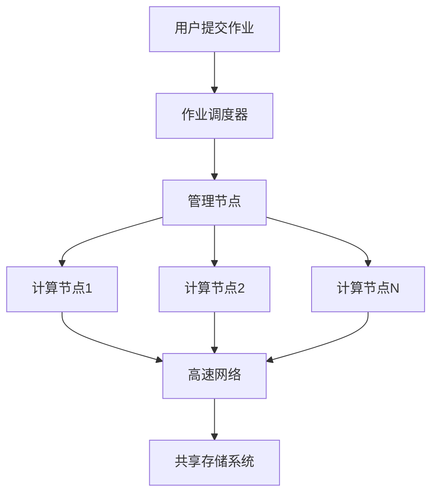
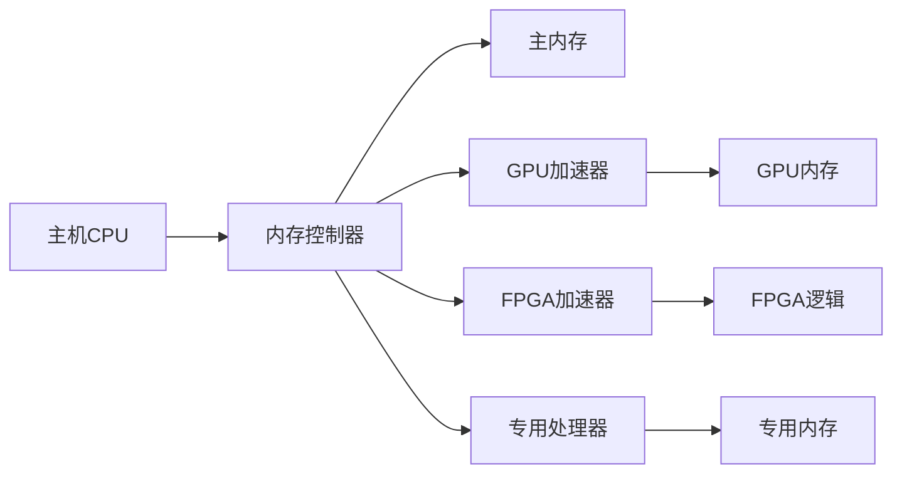
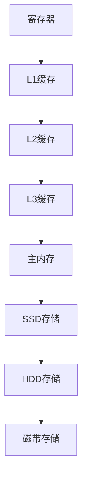

# 第四章 高性能计算架构

## 4.1 超级计算机架构

### 4.1.1 超级计算机概述

超级计算机是能够执行一般个人电脑无法处理的高速运算的计算机，主要用于科学计算、工程模拟和大规模数据分析。

### 4.1.2 集群系统

#### 概念与特点

集群系统是由多台计算机通过高速网络连接组成的并行计算系统，作为一个统一的计算资源使用。

**架构特点**：
- **松耦合**：节点间通过网络通信
- **可扩展性**：可以方便地增加或减少计算节点
- **容错性**：单个节点故障不影响整个系统
- **成本效益**：使用商用硬件构建

#### 集群架构设计



#### 实际集群示例

**TOP500超级计算机架构**：
```bash
# 典型的集群配置
# 管理节点：负责作业调度和系统管理
# 计算节点：执行实际计算任务
# 存储节点：提供共享存储
# 网络：InfiniBand或高速以太网
```

#### 集群管理系统

**作业调度系统**：
```bash
# SLURM作业调度器示例
#!/bin/bash
#SBATCH --job-name=parallel_job
#SBATCH --nodes=4
#SBATCH --ntasks-per-node=16
#SBATCH --time=01:00:00
#SBATCH --output=output_%j.log

# 加载MPI环境
module load openmpi

# 运行并行程序
mpirun -np 64 ./my_parallel_program
```

**资源管理**：
```python
# Python集群资源管理示例
class ClusterResourceManager:
    def __init__(self, nodes):
        self.nodes = nodes  # 节点列表
        self.node_status = {node: 'idle' for node in nodes}
        self.node_load = {node: 0.0 for node in nodes}

    def allocate_resources(self, job_requirements):
        """分配计算资源"""
        available_nodes = []
        for node, status in self.node_status.items():
            if status == 'idle' and self.node_load[node] < 0.8:
                available_nodes.append(node)
                if len(available_nodes) >= job_requirements['nodes']:
                    break

        if len(available_nodes) >= job_requirements['nodes']:
            for node in available_nodes:
                self.node_status[node] = 'busy'
            return available_nodes
        else:
            return None

    def monitor_cluster(self):
        """监控集群状态"""
        for node in self.nodes:
            # 模拟负载检测
            current_load = self.get_node_load(node)
            self.node_load[node] = current_load

            if current_load > 0.9:
                print(f"警告：节点 {node} 负载过高 ({current_load:.2f})")
            elif current_load < 0.1:
                print(f"提示：节点 {node} 负载较低 ({current_load:.2f})")
```

### 4.1.3 大规模并行处理器

#### MPP架构特点

大规模并行处理器（Massively Parallel Processor, MPP）是一种专门设计用于并行计算的超级计算机架构。

**核心特征**：
- **专用硬件**：针对并行计算优化的专用处理器
- **高带宽互连**：处理器间的高速通信网络
- **分布式内存**：每个处理器有独立的内存空间
- **并行操作系统**：专门设计的操作系统支持

#### MPP系统架构

```cpp
// MPP架构的简化模型
class MassivelyParallelProcessor {
private:
    std::vector<Processor> processors;
    InterconnectNetwork network;
    DistributedMemory memory;

public:
    void initialize_system(int num_processors) {
        // 初始化处理器阵列
        for (int i = 0; i < num_processors; i++) {
            processors.push_back(Processor(i));
        }

        // 建立互连网络
        network.setup_interconnect(processors);

        // 初始化分布式内存
        memory.initialize_memory(processors);
    }

    void execute_parallel_task(Task& task) {
        // 任务分解
        std::vector<SubTask> subtasks = task.decompose();

        // 任务分配
        for (int i = 0; i < subtasks.size(); i++) {
            int processor_id = i % processors.size();
            processors[processor_id].execute(subtasks[i]);
        }

        // 结果收集
        task.collect_results();
    }
};
```

#### MPP编程模型

```cpp
// MPP环境下的并行编程
#include <mpp_api.h>

void mpp_parallel_example() {
    // 初始化MPP系统
    MPP_Init();

    // 获取处理器信息
    int processor_id = MPP_GetProcessorID();
    int total_processors = MPP_GetNumProcessors();

    // 并行计算
    if (processor_id == 0) {
        // 主处理器
        distribute_data_to_processors();
    }

    // 每个处理器执行计算
    local_computation(processor_id);

    // 数据交换
    MPP_Barrier();  // 同步点
    exchange_boundary_data();

    // 结果收集
    if (processor_id == 0) {
        collect_results_from_processors();
    }

    MPP_Finalize();
}
```

### 4.1.4 向量处理器

#### 向量处理器原理

向量处理器专门设计用于高效执行向量运算，特别适合科学计算中的数组操作。

**工作原理**：
```cpp
// 向量处理器的向量操作
class VectorProcessor {
public:
    // 向量加法
    void vector_add(float* a, float* b, float* c, int n) {
        // 向量化执行
        for (int i = 0; i < n; i += VECTOR_WIDTH) {
            // 一次处理VECTOR_WIDTH个元素
            vector_register va = load_vector(a + i);
            vector_register vb = load_vector(b + i);
            vector_register vc = va + vb;
            store_vector(c + i, vc);
        }
    }

    // 向量点积
    float vector_dot_product(float* a, float* b, int n) {
        vector_register sum = zero_vector();
        for (int i = 0; i < n; i += VECTOR_WIDTH) {
            vector_register va = load_vector(a + i);
            vector_register vb = load_vector(b + i);
            sum = sum + va * vb;
        }
        return horizontal_sum(sum);
    }
};
```

#### 现代向量处理器应用

**GPU中的向量处理**：
```cuda
// CUDA中的向量操作
__global__ void vector_add_gpu(float* a, float* b, float* c, int n) {
    int idx = blockIdx.x * blockDim.x + threadIdx.x;
    if (idx < n) {
        c[idx] = a[idx] + b[idx];
    }
}

// 向量点积的CUDA实现
__global__ void vector_dot_product_gpu(float* a, float* b, float* result, int n) {
    __shared__ float shared_data[256];

    int tid = threadIdx.x;
    int idx = blockIdx.x * blockDim.x + threadIdx.x;

    // 加载数据到共享内存
    float temp = 0;
    while (idx < n) {
        temp += a[idx] * b[idx];
        idx += blockDim.x * gridDim.x;
    }

    shared_data[tid] = temp;
    __syncthreads();

    // 并行归约
    for (int stride = blockDim.x / 2; stride > 0; stride >>= 1) {
        if (tid < stride) {
            shared_data[tid] += shared_data[tid + stride];
        }
        __syncthreads();
    }

    if (tid == 0) {
        atomicAdd(result, shared_data[0]);
    }
}
```

### 4.1.5 异构计算系统

#### 异构计算概念

异构计算系统结合了不同类型的处理器（如CPU、GPU、FPGA等），每种处理器负责最适合其架构的计算任务。

**系统架构**：


#### 异构编程模型

```cpp
// OpenCL异构编程示例
#include <CL/cl.hpp>

class HeterogeneousSystem {
private:
    cl::Context context;
    cl::CommandQueue queue;
    cl::Program program;
    cl::Kernel kernel;

public:
    void initialize() {
        // 获取平台和设备
        std::vector<cl::Platform> platforms;
        cl::Platform::get(&platforms);

        std::vector<cl::Device> devices;
        platforms[0].getDevices(CL_DEVICE_TYPE_ALL, &devices);

        // 创建上下文
        context = cl::Context(devices);

        // 创建命令队列
        queue = cl::CommandQueue(context, devices[0]);

        // 编译内核程序
        std::string kernel_source = R"(
            __kernel void vector_add(__global const float* a,
                                   __global const float* b,
                                   __global float* c) {
                int i = get_global_id(0);
                c[i] = a[i] + b[i];
            }
        )";

        cl::Program::Sources sources(1,
            std::make_pair(kernel_source.c_str(),
                          kernel_source.length()));

        program = cl::Program(context, sources);
        program.build(devices);
        kernel = cl::Kernel(program, "vector_add");
    }

    void execute_heterogeneous_task() {
        // 分配设备内存
        cl::Buffer buffer_a(context, CL_MEM_READ_ONLY, size * sizeof(float));
        cl::Buffer buffer_b(context, CL_MEM_READ_ONLY, size * sizeof(float));
        cl::Buffer buffer_c(context, CL_MEM_WRITE_ONLY, size * sizeof(float));

        // 写入数据
        queue.enqueueWriteBuffer(buffer_a, CL_TRUE, 0, size * sizeof(float), data_a);
        queue.enqueueWriteBuffer(buffer_b, CL_TRUE, 0, size * sizeof(float), data_b);

        // 设置内核参数
        kernel.setArg(0, buffer_a);
        kernel.setArg(1, buffer_b);
        kernel.setArg(2, buffer_c);

        // 执行内核
        cl::NDRange global(size);
        cl::NDRange local(256);
        queue.enqueueNDRangeKernel(kernel, cl::NullRange, global, local);

        // 读取结果
        queue.enqueueReadBuffer(buffer_c, CL_TRUE, 0, size * sizeof(float), result);
    }
};
```

## 4.2 存储层次结构

### 4.2.1 存储层次概述

计算机系统采用多级存储层次结构来平衡速度、容量和成本。



### 4.2.2 寄存器

#### 寄存器特性

寄存器是CPU内部的高速存储单元，访问速度最快但容量最小。

**寄存器类型**：
- **通用寄存器**：用于数据运算
- **专用寄存器**：如程序计数器、状态寄存器
- **向量寄存器**：用于SIMD操作

#### 寄存器优化

```cpp
// 寄存器变量优化示例
void register_optimization_example() {
    // 声明寄存器变量（现代编译器通常自动优化）
    register int counter = 0;
    register float sum = 0.0f;

    // 循环中频繁使用的变量
    for (register int i = 0; i < 1000000; i++) {
        sum += data[i];
        counter++;
    }

    // 编译器内联汇编直接使用寄存器
    asm volatile (
        "movl $0, %%eax\n\t"
        "movl $1000, %%ebx\n\t"
        "loop_start:\n\t"
        "addl $1, %%eax\n\t"
        "decl %%ebx\n\t"
        "jnz loop_start\n\t"
        : "=a" (result)
        : "b" (1000)
        : "memory"
    );
}
```

### 4.2.3 缓存系统

#### 缓存层次结构

**L1缓存**：
- 速度最快，容量最小（32KB-64KB）
- 通常分为指令缓存和数据缓存
- 访问延迟：1-4个时钟周期

**L2缓存**：
- 速度较快，容量中等（256KB-1MB）
- 通常为统一缓存
- 访问延迟：10-20个时钟周期

**L3缓存**：
- 速度较慢，容量较大（几MB到几十MB）
- 多核共享
- 访问延迟：30-50个时钟周期

#### 缓存优化技术

```cpp
// 缓存友好的矩阵乘法
void cache_friendly_matrix_multiply(float* A, float* B, float* C, int N) {
    const int BLOCK_SIZE = 64;  // 根据缓存大小调整

    // 分块处理，提高缓存命中率
    for (int ii = 0; ii < N; ii += BLOCK_SIZE) {
        for (int jj = 0; jj < N; jj += BLOCK_SIZE) {
            for (int kk = 0; kk < N; kk += BLOCK_SIZE) {
                // 处理当前块
                for (int i = ii; i < min(ii + BLOCK_SIZE, N); i++) {
                    for (int j = jj; j < min(jj + BLOCK_SIZE, N); j++) {
                        float sum = C[i * N + j];
                        for (int k = kk; k < min(kk + BLOCK_SIZE, N); k++) {
                            sum += A[i * N + k] * B[k * N + j];
                        }
                        C[i * N + j] = sum;
                    }
                }
            }
        }
    }
}

// 缓存行对齐优化
struct alignas(64) CacheLineAlignedData {
    float data[16];  // 64字节对齐
    char padding[48]; // 填充到64字节
};

void cache_line_optimization() {
    // 避免伪共享
    CacheLineAlignedData thread_data[4];

    #pragma omp parallel for
    for (int i = 0; i < 4; i++) {
        // 每个线程使用独立的缓存行
        for (int j = 0; j < 16; j++) {
            thread_data[i].data[j] = i * j;
        }
    }
}
```

#### 缓存替换策略

```cpp
// LRU缓存实现示例
template<typename K, typename V>
class LRUCache {
private:
    struct CacheNode {
        K key;
        V value;
        CacheNode* prev;
        CacheNode* next;
    };

    std::unordered_map<K, CacheNode*> cache_map;
    CacheNode* head;
    CacheNode* tail;
    int capacity;
    int size;

    void add_node(CacheNode* node) {
        node->prev = head;
        node->next = head->next;
        head->next->prev = node;
        head->next = node;
    }

    void remove_node(CacheNode* node) {
        CacheNode* prev_node = node->prev;
        CacheNode* next_node = node->next;
        prev_node->next = next_node;
        next_node->prev = prev_node;
    }

    void move_to_head(CacheNode* node) {
        remove_node(node);
        add_node(node);
    }

public:
    LRUCache(int cap) : capacity(cap), size(0) {
        head = new CacheNode();
        tail = new CacheNode();
        head->next = tail;
        tail->prev = head;
    }

    V get(K key) {
        auto it = cache_map.find(key);
        if (it == cache_map.end()) {
            return V(); // 未命中
        }

        CacheNode* node = it->second;
        move_to_head(node);
        return node->value;
    }

    void put(K key, V value) {
        auto it = cache_map.find(key);
        if (it != cache_map.end()) {
            // 更新现有节点
            CacheNode* node = it->second;
            node->value = value;
            move_to_head(node);
        } else {
            // 添加新节点
            CacheNode* new_node = new CacheNode{key, value, nullptr, nullptr};
            cache_map[key] = new_node;
            add_node(new_node);
            size++;

            if (size > capacity) {
                // 移除最久未使用的节点
                CacheNode* tail_node = tail->prev;
                remove_node(tail_node);
                cache_map.erase(tail_node->key);
                delete tail_node;
                size--;
            }
        }
    }
};
```

### 4.2.4 主内存（DRAM）

#### DRAM特性

动态随机存取存储器（DRAM）是计算机的主要工作内存。

**特性参数**：
- **访问延迟**：50-100纳秒
- **带宽**：几十到几百GB/s
- **容量**：几GB到几TB
- **易失性**：断电后数据丢失

#### 内存优化技术

```cpp
// 内存对齐优化
struct alignas(32) AlignedStruct {
    float x, y, z, w;
};

// 内存池管理
class MemoryPool {
private:
    char* pool;
    size_t pool_size;
    size_t offset;
    std::vector<void*> allocated_blocks;

public:
    MemoryPool(size_t size) : pool_size(size), offset(0) {
        pool = new char[size];
    }

    ~MemoryPool() {
        delete[] pool;
    }

    void* allocate(size_t size) {
        size_t aligned_size = align_size(size);
        if (offset + aligned_size > pool_size) {
            return nullptr; // 内存不足
        }

        void* ptr = pool + offset;
        offset += aligned_size;
        allocated_blocks.push_back(ptr);
        return ptr;
    }

    void deallocate_all() {
        offset = 0;
        allocated_blocks.clear();
    }

private:
    size_t align_size(size_t size) {
        const size_t alignment = 32;
        return (size + alignment - 1) & ~(alignment - 1);
    }
};

// NUMA感知的内存分配
void numa_aware_allocation() {
    #ifdef USE_NUMA
    struct bitmask* mask = numa_allocate_nodemask();
    numa_bitmask_setbit(mask, 0);  // 分配到节点0

    void* memory = numa_alloc_onnode(1024 * 1024, 0);
    // 使用内存...

    numa_free(memory, 1024 * 1024);
    numa_free_nodemask(mask);
    #endif
}
```

### 4.2.5 存储设备

#### SSD存储

固态硬盘（SSD）使用闪存技术，提供比传统硬盘更快的访问速度。

**SSD特性**：
- **读取延迟**：0.1毫秒
- **写入延迟**：0.05-0.1毫秒
- **寿命限制**：有限的写入次数
- **随机访问**：性能优异

#### HDD存储

机械硬盘（HDD）使用旋转磁盘和磁头，提供大容量存储但速度较慢。

**HDD特性**：
- **读取延迟**：5-10毫秒
- **写入延迟**：5-10毫秒
- **容量**：TB级别
- **成本**：相对较低

#### 存储优化策略

```cpp
// 分层存储管理系统
class TieredStorageManager {
private:
    std::string ssd_path;
    std::string hdd_path;
    std::unordered_map<std::string, StorageTier> file_tiers;

public:
    enum StorageTier {
        TIER_SSD,   // 热数据
        TIER_HDD,   // 冷数据
        TIER_TAPE   // 归档数据
    };

    void store_file(const std::string& filename, const std::string& data) {
        // 根据文件大小和访问模式选择存储层级
        StorageTier tier = determine_tier(filename, data.size());

        switch (tier) {
            case TIER_SSD:
                write_to_ssd(filename, data);
                break;
            case TIER_HDD:
                write_to_hdd(filename, data);
                break;
            case TIER_TAPE:
                write_to_tape(filename, data);
                break;
        }

        file_tiers[filename] = tier;
    }

    std::string retrieve_file(const std::string& filename) {
        auto it = file_tiers.find(filename);
        if (it == file_tiers.end()) {
            throw std::runtime_error("File not found");
        }

        StorageTier tier = it->second;
        std::string data;

        switch (tier) {
            case TIER_SSD:
                data = read_from_ssd(filename);
                break;
            case TIER_HDD:
                data = read_from_hdd(filename);
                break;
            case TIER_TAPE:
                data = read_from_tape(filename);
                break;
        }

        // 更新访问统计
        update_access_stats(filename);

        return data;
    }

private:
    StorageTier determine_tier(const std::string& filename, size_t size) {
        // 简单的分层策略
        if (size < 100 * 1024 * 1024) {  // 小于100MB
            return TIER_SSD;
        } else if (size < 10 * 1024 * 1024 * 1024) {  // 小于10GB
            return TIER_HDD;
        } else {
            return TIER_TAPE;
        }
    }
};
```

## 4.3 互连网络

### 4.3.1 总线结构

#### 总线架构特点

总线结构是最简单的互连方式，所有设备共享同一通信通道。

**优缺点**：
- ✅ **简单**：设计和实现简单
- ✅ **成本低**：硬件成本较低
- ❌ **扩展性差**：总线带宽限制
- ❌ **争用问题**：设备间竞争总线使用权

#### 总线协议

```cpp
// 简化的总线仲裁协议
class BusArbitration {
private:
    std::mutex bus_mutex;
    std::condition_variable bus_cv;
    bool bus_busy;
    std::queue<int> request_queue;

public:
    bool request_bus_access(int device_id) {
        std::unique_lock<std::mutex> lock(bus_mutex);

        // 检查总线是否空闲
        if (!bus_busy) {
            bus_busy = true;
            return true;
        }

        // 加入请求队列
        request_queue.push(device_id);

        // 等待总线可用
        bus_cv.wait(lock, [this]() { return !bus_busy; });

        bus_busy = true;
        return true;
    }

    void release_bus(int device_id) {
        std::lock_guard<std::mutex> lock(bus_mutex);

        bus_busy = false;

        // 唤醒等待的设备
        bus_cv.notify_one();
    }
};
```

### 4.3.2 网格网络

#### 2D网格拓扑

2D网格是超级计算机中常用的互连拓扑结构。

**拓扑特性**：
- **邻居连接**：每个节点连接上下左右四个邻居
- **直径**：O(√N)，其中N是节点数
- **度数**：每个节点4个连接
- **可扩展性**：良好的可扩展性

#### 网格路由算法

```cpp
// 2D网格路由算法
class MeshRouter {
private:
    int rows, cols;

public:
    MeshRouter(int r, int c) : rows(r), cols(c) {}

    struct Route {
        std::vector<std::pair<int, int>> path;
        int hops;
    };

    Route find_route(int src_row, int src_col,
                    int dst_row, int dst_col) {
        Route route;
        int current_row = src_row;
        int current_col = src_col;

        // X-Y路由：先沿X轴，再沿Y轴
        while (current_col != dst_col) {
            if (current_col < dst_col) {
                current_col++;
            } else {
                current_col--;
            }
            route.path.push_back({current_row, current_col});
        }

        while (current_row != dst_row) {
            if (current_row < dst_row) {
                current_row++;
            } else {
                current_row--;
            }
            route.path.push_back({current_row, current_col});
        }

        route.hops = route.path.size();
        return route;
    }

    // 虚拟通道分配
    int allocate_virtual_channel(int src, int dst) {
        // 简单的虚拟通道分配策略
        return (src + dst) % 4;
    }
};
```

#### 3D网格扩展

```cpp
// 3D网格路由
class ThreeDMeshRouter {
private:
    int x_dim, y_dim, z_dim;

public:
    ThreeDMeshRouter(int x, int y, int z)
        : x_dim(x), y_dim(y), z_dim(z) {}

    struct Route3D {
        std::vector<std::tuple<int, int, int>> path;
        int hops;
    };

    Route3D find_route_3d(int src_x, int src_y, int src_z,
                         int dst_x, int dst_y, int dst_z) {
        Route3D route;
        int x = src_x, y = src_y, z = src_z;

        // 3D X-Y-Z路由
        while (x != dst_x) {
            x = (x < dst_x) ? x + 1 : x - 1;
            route.path.push_back({x, y, z});
        }

        while (y != dst_y) {
            y = (y < dst_y) ? y + 1 : y - 1;
            route.path.push_back({x, y, z});
        }

        while (z != dst_z) {
            z = (z < dst_z) ? z + 1 : z - 1;
            route.path.push_back({x, y, z});
        }

        route.hops = route.path.size();
        return route;
    }
};
```

### 4.3.3 超立方体网络

#### 超立方体拓扑

超立方体是一种理论上的理想互连网络，具有对数级直径。

**数学特性**：
- **节点数**：2^d，其中d是维度
- **直径**：d（对数级）
- **度数**：d
- **对称性**：高度对称

#### 超立方体路由

```cpp
// 超立方体路由算法
class HypercubeRouter {
private:
    int dimensions;

public:
    HypercubeRouter(int d) : dimensions(d) {}

    struct HypercubeRoute {
        std::vector<int> path;
        int hops;
    };

    HypercubeRoute find_route(int source, int destination) {
        HypercubeRoute route;
        route.path.push_back(source);

        int current = source;
        int diff = source ^ destination;  // 异或找出不同位

        // 逐位修正
        for (int i = 0; i < dimensions; i++) {
            if (diff & (1 << i)) {
                // 翻转第i位
                current ^= (1 << i);
                route.path.push_back(current);
            }
        }

        route.hops = route.path.size() - 1;
        return route;
    }

    // 超立方体邻居计算
    std::vector<int> get_neighbors(int node) {
        std::vector<int> neighbors;
        for (int i = 0; i < dimensions; i++) {
            neighbors.push_back(node ^ (1 << i));
        }
        return neighbors;
    }
};

// 超立方体网络模拟
void hypercube_network_simulation() {
    HypercubeRouter router(4);  // 4维超立方体，16个节点

    // 查找路由
    auto route = router.find_route(5, 12);  // 从节点5到节点12

    std::cout << "Route from 5 to 12: ";
    for (int node : route.path) {
        std::cout << node << " ";
    }
    std::cout << "\nHops: " << route.hops << std::endl;

    // 获取邻居
    auto neighbors = router.get_neighbors(5);
    std::cout << "Neighbors of node 5: ";
    for (int neighbor : neighbors) {
        std::cout << neighbor << " ";
    }
    std::cout << std::endl;
}
```

### 4.3.4 胖树网络

#### 胖树架构

胖树是一种数据中心常用的网络拓扑，提供高带宽和低延迟。

**架构特点**：
- **多层级**：接入层、汇聚层、核心层
- **带宽递增**：向上带宽逐渐增加
- **无阻塞**：任意两点间有足够带宽

#### 胖树路由算法

```cpp
// 胖树路由实现
class FatTreeRouter {
private:
    struct Switch {
        int id;
        std::vector<int> ports;
        int level;  // 0:接入层, 1:汇聚层, 2:核心层
    };

    std::vector<Switch> switches;
    std::unordered_map<int, int> server_to_switch;  // 服务器到接入交换机映射

public:
    FatTreeRouter(int k) {
        // k-胖树构造
        int num_pods = k;
        int servers_per_pod = k / 2;
        int switches_per_pod = k;

        // 创建接入层交换机
        for (int pod = 0; pod < num_pods; pod++) {
            for (int i = 0; i < k / 2; i++) {
                int switch_id = pod * k + i;
                Switch sw{switch_id, {}, 0};
                switches.push_back(sw);

                // 连接服务器
                for (int j = 0; j < k / 2; j++) {
                    int server_id = switch_id * (k / 2) + j;
                    server_to_switch[server_id] = switch_id;
                }
            }

            // 创建汇聚层交换机
            for (int i = k / 2; i < k; i++) {
                int switch_id = pod * k + i;
                Switch sw{switch_id, {}, 1};
                switches.push_back(sw);
            }
        }

        // 创建核心层交换机
        int num_core_switches = k * k / 4;
        for (int i = 0; i < num_core_switches; i++) {
            int switch_id = num_pods * k + i;
            Switch sw{switch_id, {}, 2};
            switches.push_back(sw);
        }
    }

    struct FatTreeRoute {
        std::vector<int> path;  // 交换机路径
        std::vector<int> servers; // 服务器路径
    };

    FatTreeRoute find_route(int src_server, int dst_server) {
        FatTreeRoute route;

        // 获取源和目的交换机
        int src_switch = server_to_switch[src_server];
        int dst_switch = server_to_switch[dst_server];

        // 同一接入交换机
        if (src_switch == dst_switch) {
            route.servers = {src_server, dst_server};
            return route;
        }

        // 同一Pod内
        int src_pod = src_switch / k;
        int dst_pod = dst_switch / k;

        if (src_pod == dst_pod) {
            // 通过汇聚层
            int agg_switch = src_pod * k + k / 2;
            route.path = {src_switch, agg_switch, dst_switch};
        } else {
            // 通过核心层
            int core_switch = (src_switch % (k / 2)) * (k / 2) + (dst_switch % (k / 2));
            core_switch += num_pods * k;

            route.path = {src_switch, src_pod * k + k / 2, core_switch,
                         dst_pod * k + k / 2, dst_switch};
        }

        route.servers = {src_server, dst_server};
        return route;
    }
};
```

### 4.3.5 InfiniBand技术

#### InfiniBand概述

InfiniBand是一种高性能网络互连技术，广泛用于高性能计算和数据中心。

**技术特点**：
- **高带宽**：支持EDR（100Gb/s）、HDR（200Gb/s）、NDR（400Gb/s）
- **低延迟**：微秒级延迟
- **远程内存访问**：支持RDMA
- **服务质量**：支持QoS和流量控制

#### InfiniBand编程

```cpp
// InfiniBand RDMA示例（使用verbs API）
#include <infiniband/verbs.h>
#include <rdma/rdma_cma.h>

class InfiniBandRDMA {
private:
    struct ibv_context* context;
    struct ibv_pd* pd;
    struct ibv_mr* mr;
    struct ibv_cq* cq;
    struct ibv_qp* qp;
    struct rdma_cm_id* cm_id;

public:
    bool initialize() {
        // 获取InfiniBand设备
        struct ibv_device** devices = ibv_get_device_list(NULL);
        if (!devices) {
            return false;
        }

        // 打开设备
        context = ibv_open_device(devices[0]);
        if (!context) {
            return false;
        }

        // 创建保护域
        pd = ibv_alloc_pd(context);
        if (!pd) {
            return false;
        }

        // 创建完成队列
        cq = ibv_create_cq(context, 100, NULL, NULL, 0);
        if (!cq) {
            return false;
        }

        return true;
    }

    void* allocate_memory(size_t size, uint64_t& addr, uint32_t& rkey) {
        // 分配内存并注册到InfiniBand
        void* memory = malloc(size);
        if (!memory) {
            return nullptr;
        }

        mr = ibv_reg_mr(pd, memory, size,
                       IBV_ACCESS_LOCAL_WRITE |
                       IBV_ACCESS_REMOTE_WRITE |
                       IBV_ACCESS_REMOTE_READ);

        if (!mr) {
            free(memory);
            return nullptr;
        }

        addr = mr->addr;
        rkey = mr->rkey;
        return memory;
    }

    bool post_receive(void* buffer, size_t size) {
        struct ibv_sge sg;
        sg.addr = (uint64_t)buffer;
        sg.length = size;
        sg.lkey = mr->lkey;

        struct ibv_recv_wr wr, *bad_wr;
        wr.wr_id = 1;
        wr.next = nullptr;
        wr.sg_list = &sg;
        wr.num_sge = 1;

        return ibv_post_recv(qp, &wr, &bad_wr) == 0;
    }

    bool post_send(void* buffer, size_t size, uint64_t remote_addr, uint32_t remote_rkey) {
        struct ibv_sge sg;
        sg.addr = (uint64_t)buffer;
        sg.length = size;
        sg.lkey = mr->lkey;

        struct ibv_send_wr wr, *bad_wr;
        wr.wr_id = 2;
        wr.next = nullptr;
        wr.sg_list = &sg;
        wr.num_sge = 1;
        wr.opcode = IBV_WR_RDMA_WRITE;
        wr.send_flags = IBV_SEND_SIGNALED;
        wr.wr.rdma.remote_addr = remote_addr;
        wr.wr.rdma.rkey = remote_rkey;

        return ibv_post_send(qp, &wr, &bad_wr) == 0;
    }

    ~InfiniBandRDMA() {
        if (mr) ibv_dereg_mr(mr);
        if (cq) ibv_destroy_cq(cq);
        if (pd) ibv_dealloc_pd(pd);
        if (context) ibv_close_device(context);
    }
};

// 使用示例
void infiniband_rdma_example() {
    InfiniBandRDMA rdma;

    if (!rdma.initialize()) {
        std::cerr << "Failed to initialize InfiniBand" << std::endl;
        return;
    }

    const size_t buffer_size = 1024 * 1024;
    uint64_t local_addr, remote_addr;
    uint32_t local_rkey, remote_rkey;

    // 分配内存
    void* send_buffer = rdma.allocate_memory(buffer_size, local_addr, local_rkey);
    void* recv_buffer = rdma.allocate_memory(buffer_size, remote_addr, remote_rkey);

    if (!send_buffer || !recv_buffer) {
        std::cerr << "Failed to allocate memory" << std::endl;
        return;
    }

    // 填充发送数据
    memset(send_buffer, 'A', buffer_size);

    // 发送数据
    rdma.post_send(send_buffer, buffer_size, remote_addr, remote_rkey);

    // 接收数据
    rdma.post_receive(recv_buffer, buffer_size);

    std::cout << "InfiniBand RDMA example completed" << std::endl;
}
```

## 4.4 处理器架构

### 4.4.1 多核处理器

#### 多核架构特点

多核处理器将多个处理核心集成在单个芯片上，提供并行计算能力。

**架构优势**：
- **片上通信**：核心间通信延迟低
- **共享缓存**：L3缓存通常被所有核心共享
- **功耗效率**：相比多芯片方案更节能
- **面积效率**：更高的晶体管利用率

#### 多核编程模型

```cpp
// 多核处理器的并行编程
#include <thread>
#include <vector>
#include <atomic>

class MultiCoreProcessor {
private:
    int num_cores;
    std::vector<std::thread> cores;

public:
    MultiCoreProcessor(int cores) : num_cores(cores) {}

    void execute_parallel_task(std::function<void(int)> task) {
        // 启动多个线程
        for (int i = 0; i < num_cores; i++) {
            cores.emplace_back([task, i]() {
                task(i);  // 每个核心执行任务
            });
        }

        // 等待所有线程完成
        for (auto& core : cores) {
            core.join();
        }
    }

    // NUMA感知的任务分配
    void numa_aware_scheduling() {
        #ifdef USE_NUMA
        for (int i = 0; i < num_cores; i++) {
            // 将线程绑定到特定的NUMA节点
            cpu_set_t cpuset;
            CPU_ZERO(&cpuset);
            CPU_SET(i, &cpuset);
            pthread_setaffinity_np(cores[i].native_handle(), sizeof(cpuset), &cpuset);
        }
        #endif
    }
};

// 多核缓存一致性协议模拟
class CacheCoherenceProtocol {
private:
    enum CacheState { INVALID, SHARED, EXCLUSIVE, MODIFIED };
    std::vector<CacheState> cache_states;
    std::mutex coherence_mutex;

public:
    CacheCoherenceProtocol(int num_cores) : cache_states(num_cores, INVALID) {}

    bool read(int core_id, int address) {
        std::lock_guard<std::mutex> lock(coherence_mutex);

        CacheState current_state = cache_states[core_id];

        switch (current_state) {
            case INVALID:
                // 从内存或其他缓存读取
                cache_states[core_id] = SHARED;
                return true;

            case SHARED:
            case EXCLUSIVE:
                return true;

            case MODIFIED:
                return true;

            default:
                return false;
        }
    }

    bool write(int core_id, int address) {
        std::lock_guard<std::mutex> lock(coherence_mutex);

        // 使其他缓存失效
        for (int i = 0; i < cache_states.size(); i++) {
            if (i != core_id && cache_states[i] != INVALID) {
                cache_states[i] = INVALID;
            }
        }

        cache_states[core_id] = MODIFIED;
        return true;
    }
};
```

### 4.4.2 众核处理器

#### 众核架构

众核处理器（Many-core）包含大量简化的核心，专注于高吞吐量计算。

**典型架构**：
- **Intel Xeon Phi**：60+核心，SIMD向量单元
- **NVIDIA GPU**：数千个小核心，高并行度
- **Google TPU**：专用AI加速器

#### 众核编程

```cpp
// 众核处理器编程示例（使用OpenCL）
#include <CL/cl.hpp>

class ManyCoreProcessor {
private:
    cl::Context context;
    cl::CommandQueue queue;
    cl::Program program;
    cl::Kernel kernel;

public:
    void initialize_manycore() {
        // 获取众核设备
        std::vector<cl::Platform> platforms;
        cl::Platform::get(&platforms);

        std::vector<cl::Device> devices;
        platforms[0].getDevices(CL_DEVICE_TYPE_ACCELERATOR, &devices);

        // 创建上下文和队列
        context = cl::Context(devices);
        queue = cl::CommandQueue(context, devices[0],
                                CL_QUEUE_OUT_OF_ORDER_EXEC_MODE_ENABLE);

        // 编译内核
        std::string kernel_source = R"(
            __kernel void manycore_kernel(__global const float* input,
                                        __global float* output,
                                        const int size) {
                int gid = get_global_id(0);
                if (gid < size) {
                    // 众核并行处理
                    float sum = 0.0f;
                    for (int i = 0; i < 1000; i++) {
                        sum += sin(input[gid] * i);
                    }
                    output[gid] = sum;
                }
            }
        )";

        cl::Program::Sources sources(1,
            std::make_pair(kernel_source.c_str(), kernel_source.length()));

        program = cl::Program(context, sources);
        program.build(devices);
        kernel = cl::Kernel(program, "manycore_kernel");
    }

    void execute_manycore_task(const std::vector<float>& input,
                              std::vector<float>& output) {
        size_t size = input.size();

        // 创建设备内存
        cl::Buffer input_buffer(context, CL_MEM_READ_ONLY | CL_MEM_COPY_HOST_PTR,
                              size * sizeof(float), (void*)input.data());
        cl::Buffer output_buffer(context, CL_MEM_WRITE_ONLY, size * sizeof(float));

        // 设置内核参数
        kernel.setArg(0, input_buffer);
        kernel.setArg(1, output_buffer);
        kernel.setArg(2, (int)size);

        // 执行内核
        cl::NDRange global(size);
        cl::NDRange local(256);  // 工作组大小

        cl::Event event;
        queue.enqueueNDRangeKernel(kernel, cl::NullRange, global, local, nullptr, &event);
        event.wait();

        // 读取结果
        queue.enqueueReadBuffer(output_buffer, CL_TRUE, 0,
                               size * sizeof(float), output.data());
    }
};
```

### 4.4.3 GPU架构

#### GPU架构特点

图形处理器（GPU）专为并行计算设计，包含大量简化的核心。

**架构组件**：
- **SM（Streaming Multiprocessor）**：处理单元集群
- **CUDA核心**：基本的计算单元
- **共享内存**：SM内的高速内存
- **全局内存**：GPU的主内存

#### GPU内存层次

```cuda
// GPU内存层次优化
__global__ void memory_hierarchy_optimization(float* input, float* output, int n) {
    // 共享内存（每个SM内共享）
    __shared__ float shared_data[256];

    int tid = threadIdx.x;
    int bid = blockIdx.x;
    int gid = bid * blockDim.x + tid;

    // 寄存器变量（每个线程私有）
    float register_var = 0.0f;

    // 使用共享内存减少全局内存访问
    if (gid < n) {
        shared_data[tid] = input[gid];
    }
    __syncthreads();

    // 计算
    if (tid > 0) {
        register_var = shared_data[tid] + shared_data[tid - 1];
    }

    __syncthreads();

    if (gid < n) {
        output[gid] = register_var;
    }
}

// 纹理内存优化
texture<float, 1, cudaReadModeElementType> tex_input;

__global__ void texture_memory_optimization(float* output, int n) {
    int idx = blockIdx.x * blockDim.x + threadIdx.x;

    if (idx < n) {
        // 纹理内存提供缓存和插值
        float value = tex1D(tex_input, idx);
        output[idx] = value * 2.0f;
    }
}

// 常量内存优化
__constant__ float const_data[256];

__global__ void constant_memory_optimization(float* output, int n) {
    int idx = blockIdx.x * blockDim.x + threadIdx.x;

    if (idx < n) {
        float sum = 0.0f;
        // 常量内存缓存效果好
        for (int i = 0; i < 256; i++) {
            sum += output[idx] * const_data[i];
        }
        output[idx] = sum;
    }
}
```

### 4.4.4 异构架构

#### 异构计算系统

异构架构结合了不同类型的处理器，每种处理器负责最适合的任务。

**系统组成**：
- **CPU**：通用计算，控制逻辑
- **GPU**：大规模并行计算
- **FPGA**：可编程硬件加速
- **专用加速器**：AI、加密等专用任务

#### 异构编程框架

```cpp
// SYCL异构编程示例
#include <CL/sycl.hpp>

class HeterogeneousSystemSYCL {
public:
    void execute_heterogeneous_task() {
        // 定义设备选择器
        sycl::cpu_selector cpu_selector;
        sycl::gpu_selector gpu_selector;

        // 创建队列
        sycl::queue cpu_queue(cpu_selector);
        sycl::queue gpu_queue(gpu_selector);

        const int size = 1024 * 1024;
        std::vector<float> data(size);

        // CPU任务：控制和串行处理
        cpu_queue.submit([&](sycl::handler& cgh) {
            auto data_accessor = sycl::host_accessor(data, sycl::read_write);

            cgh.single_task([=]() {
                // CPU适合的串行任务
                for (int i = 0; i < 1000; i++) {
                    data[0] += i;
                }
            });
        });

        // GPU任务：大规模并行计算
        gpu_queue.submit([&](sycl::handler& cgh) {
            auto data_accessor = sycl::device_accessor(data, sycl::read_write, cgh);

            cgh.parallel_for(sycl::range<1>(size), [=](sycl::id<1> idx) {
                // GPU适合的并行任务
                int i = idx[0];
                data[i] = data[i] * 2.0f + 1.0f;
            });
        });

        // 等待所有任务完成
        cpu_queue.wait();
        gpu_queue.wait();
    }
};

// OpenACC异构编程
void openacc_heterogeneous_example() {
    const int size = 1000000;
    float data[size];

    // 初始化数据
    #pragma acc parallel loop
    for (int i = 0; i < size; i++) {
        data[i] = i * 0.1f;
    }

    // CPU和GPU协同计算
    #pragma acc parallel loop
    for (int i = 0; i < size; i++) {
        #ifdef _OPENACC
        // GPU上执行
        data[i] = sin(data[i]) * cos(data[i]);
        #else
        // CPU上执行
        data[i] = data[i] * data[i];
        #endif
    }
}
```

## 4.5 本章小结

本章详细介绍了高性能计算的各种架构：

1. **超级计算机架构**：从集群系统到大规模并行处理器，展示了不同规模的计算系统设计
2. **存储层次结构**：从寄存器到磁带存储，解释了多级存储的设计原理和优化策略
3. **互连网络**：介绍了总线、网格、超立方体、胖树等不同拓扑结构的特点和应用
4. **处理器架构**：涵盖了多核、众核、GPU和异构计算等现代处理器架构

理解这些架构对于设计高效的并行算法和优化程序性能至关重要。在实际应用中，需要根据具体问题的特点选择合适的架构和优化策略。

## 练习题

1. **简答题**：比较集群系统和MPP系统的优缺点。
2. **分析题**：分析缓存未命中对程序性能的影响，并提出优化策略。
3. **编程题**：实现一个基于网格拓扑的路由算法。
4. **设计题**：设计一个异构计算系统的任务分配策略。
5. **讨论题**：讨论未来高性能计算架构的发展趋势。